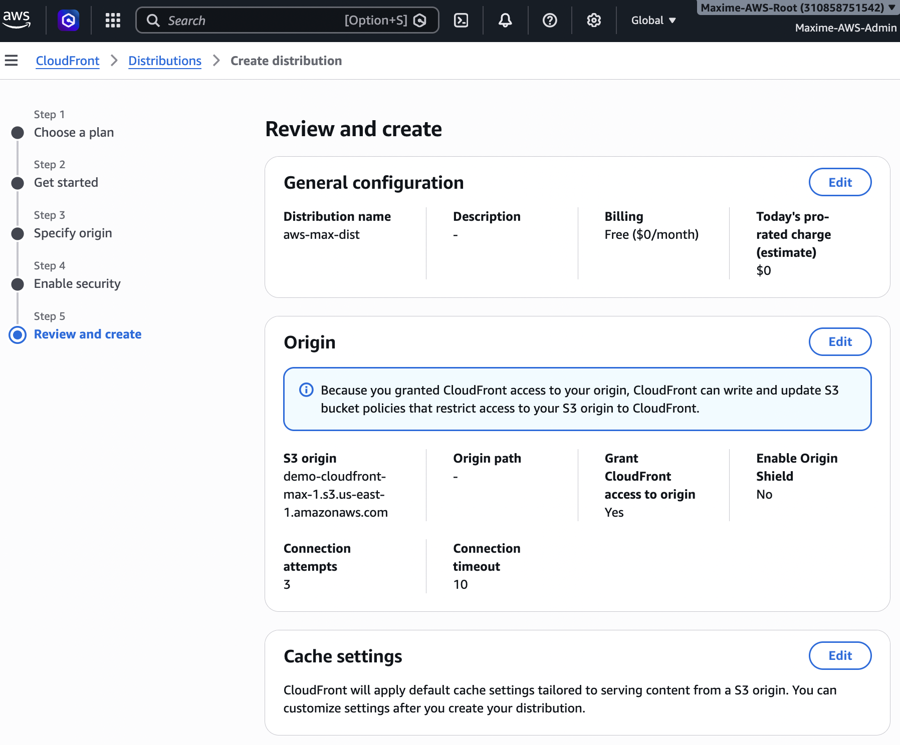
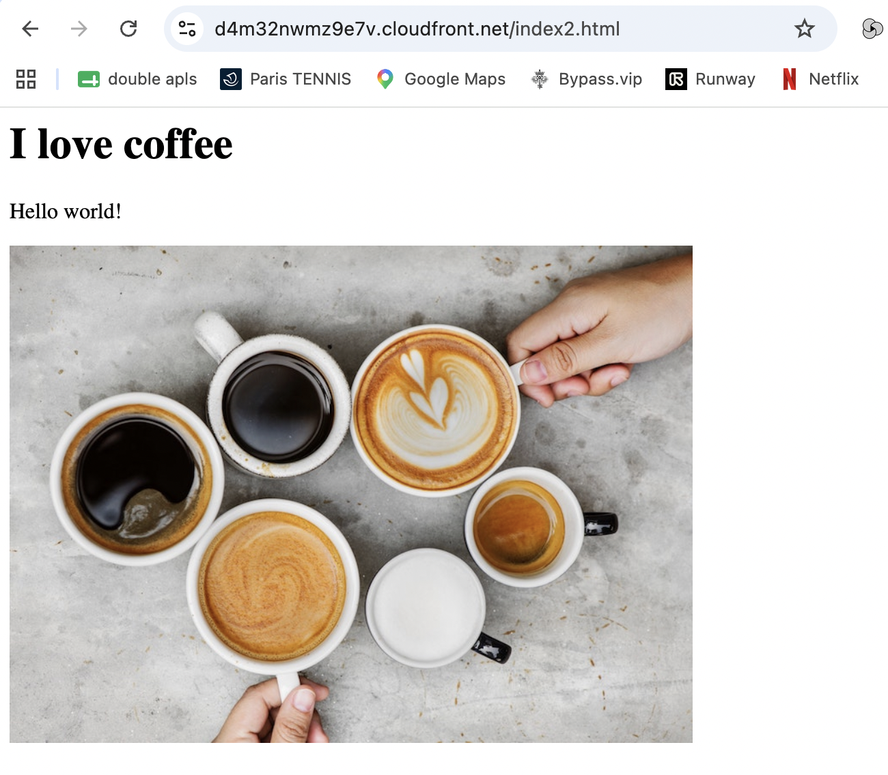

# AWS CloudFront & Global Accelerator

This lab covers Amazon CloudFront and AWS Global Accelerator, two AWS services designed to improve application performance, availability, and global content delivery.

---

## 1. CloudFront Overview

Amazon CloudFront is AWS's Content Delivery Network (CDN).

It distributes content through a global network of edge locations, allowing users to access applications and content with lower latency.

Key concepts:

- Edge Locations
- Origins
- Distributions
- Caching
- TTL (Time To Live)
- Origin Access
- HTTPS support



---

## 2. CloudFront with Amazon S3

Created a CloudFront distribution using an Amazon S3 bucket as the origin.

This architecture allows static content stored in S3 to be cached and delivered through CloudFront edge locations.

Architecture:

```text
User
  ↓
CloudFront Edge Location
  ↓
CloudFront Distribution
  ↓
Amazon S3 Bucket
```



---

## 3. CloudFront with an Application Load Balancer

Configured an Application Load Balancer (ALB) as a CloudFront origin.

This allows dynamic web applications running behind an ALB to benefit from CloudFront's global edge network.

Architecture:

```text
User
  ↓
CloudFront
  ↓
Application Load Balancer
  ↓
EC2 Instances
```


---

## 4. CloudFront Geo Restriction

CloudFront can restrict content delivery based on the geographic location of users.

Two approaches are available:

- Allowlist: only selected countries can access the content.
- Blocklist: selected countries are prevented from accessing the content.


---

## 5. CloudFront Price Classes

CloudFront Price Classes allow control over which edge locations are used by a distribution.

Available options include:

- **Price Class All** – uses all CloudFront edge locations.
- **Price Class 200** – excludes the most expensive edge locations.
- **Price Class 100** – uses the lowest-cost regions.

Price Classes provide a trade-off between global performance and cost.


---

## 6. CloudFront Cache Invalidation

CloudFront caches objects at edge locations.

When an object is updated at the origin, an invalidation can be created to remove the cached version before its TTL expires.

Example:

```text
/index.html
/images/*
/*
```

Using `/*` invalidates all cached objects in the distribution.


---

## 7. AWS Global Accelerator Overview

AWS Global Accelerator improves the availability and performance of global applications by routing traffic through the AWS global network.

Unlike CloudFront, Global Accelerator is not primarily a caching service.

Key features:

- Two static Anycast IP addresses
- AWS global network
- Health checks
- Automatic traffic routing
- Multi-region architectures
- TCP and UDP support

Architecture:

```text
Users
  ↓
AWS Edge Location
  ↓
AWS Global Network
  ↓
Global Accelerator
  ↓
Regional Endpoints
```


---

## 8. AWS Global Accelerator Hands-On

Created and configured an AWS Global Accelerator.

Global Accelerator routes users to healthy AWS endpoints through the AWS global network rather than relying entirely on the public Internet.

Possible endpoints include:

- Application Load Balancers
- Network Load Balancers
- EC2 Instances
- Elastic IP addresses


---

## CloudFront vs Global Accelerator

| Feature | CloudFront | Global Accelerator |
|---|---|---|
| Primary purpose | Content delivery / CDN | Network acceleration |
| Caching | Yes | No |
| Static IP addresses | No | Yes |
| Protocols | HTTP / HTTPS | TCP / UDP |
| Edge Locations | Yes | Yes |
| Uses AWS global network | Yes | Yes |
| Typical use | Websites, APIs, static content | Global applications, gaming, TCP/UDP workloads |

---

## Key Takeaways

- CloudFront is AWS's global CDN.
- CloudFront caches content at edge locations.
- S3 and ALB can be used as CloudFront origins.
- Geo Restriction controls access based on country.
- Price Classes help optimize CloudFront costs.
- Cache Invalidations remove cached objects before TTL expiration.
- Global Accelerator provides static Anycast IP addresses.
- Global Accelerator routes traffic through the AWS global network.
- CloudFront focuses on content delivery and caching, while Global Accelerator focuses on network performance and availability.
