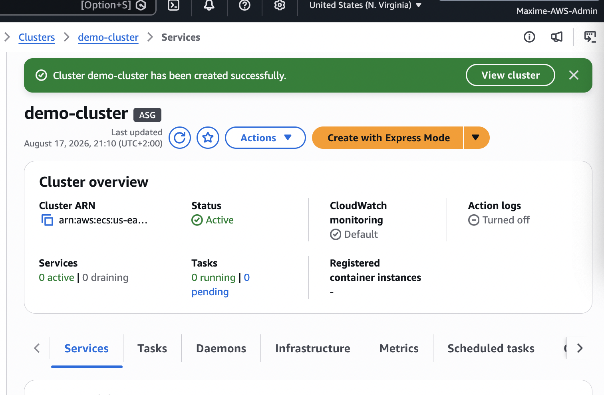
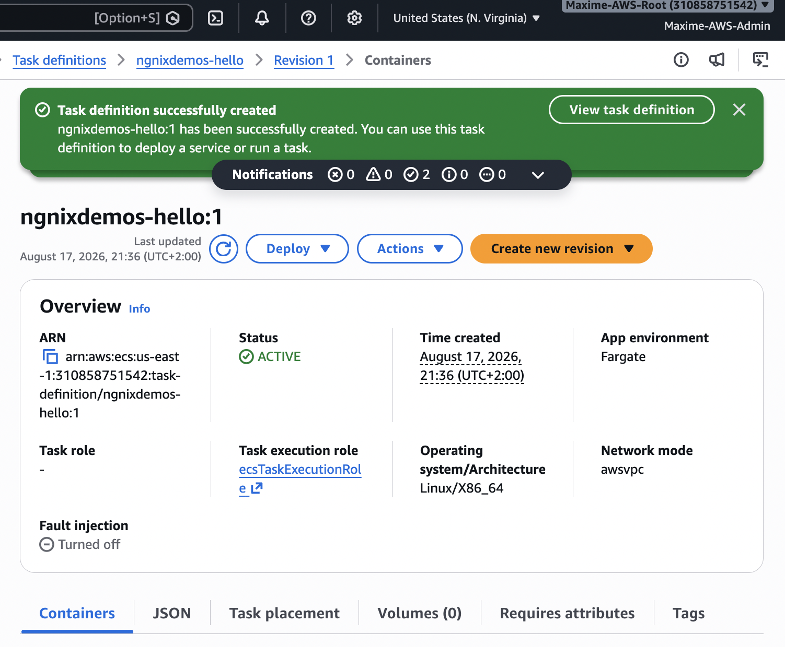
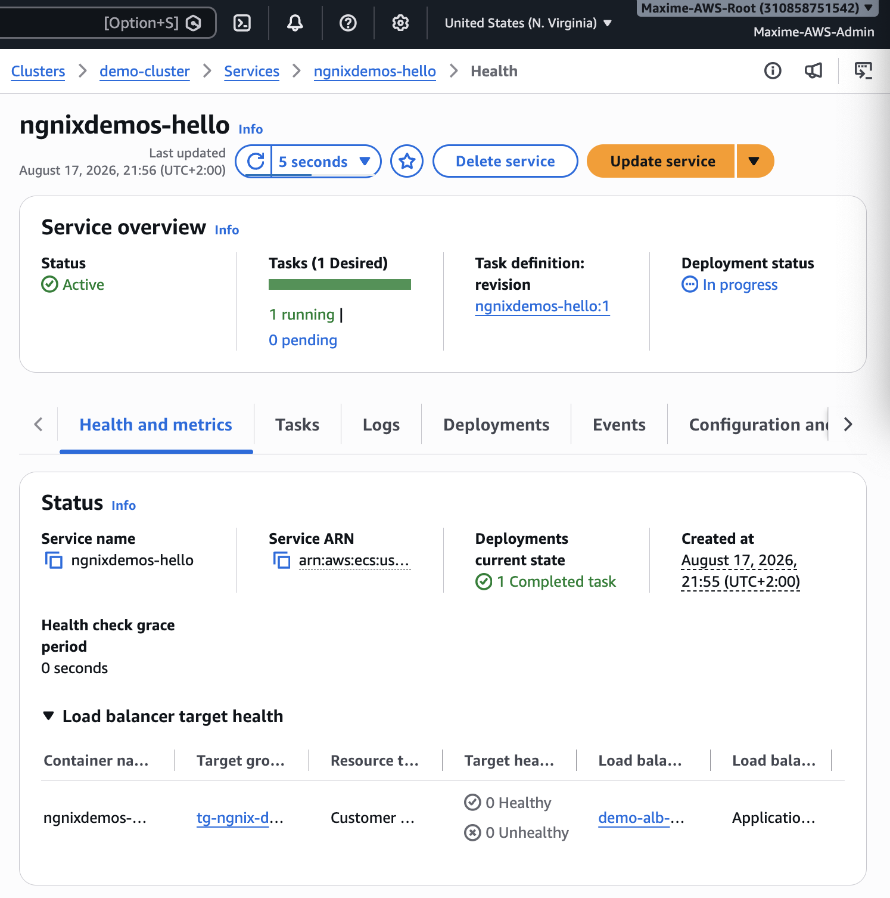
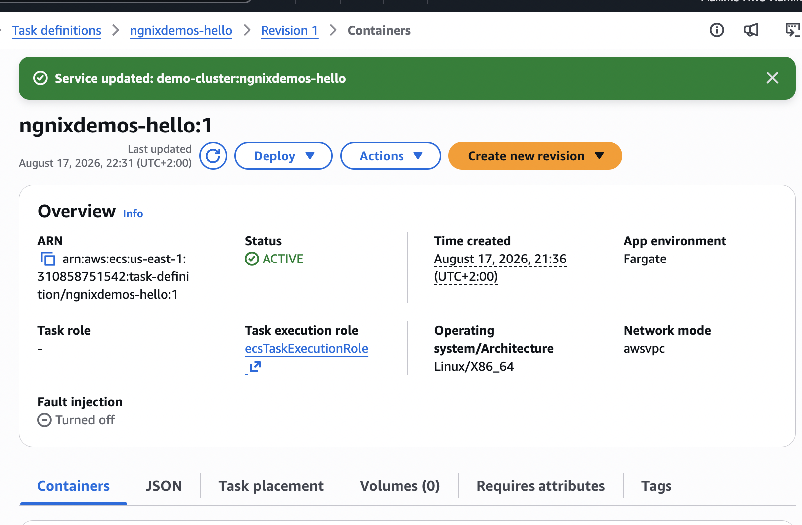
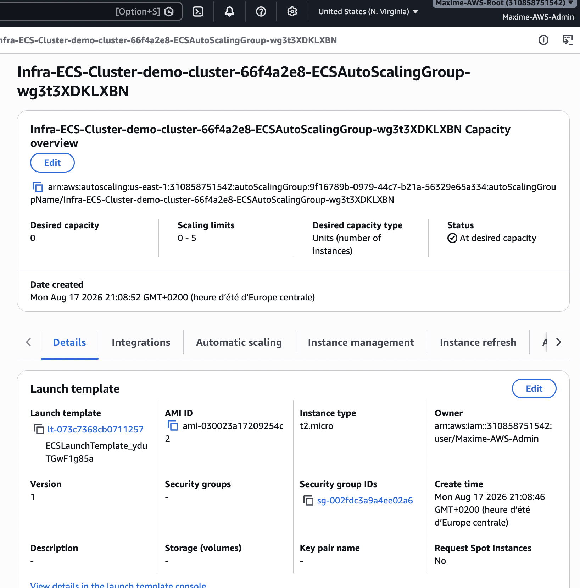
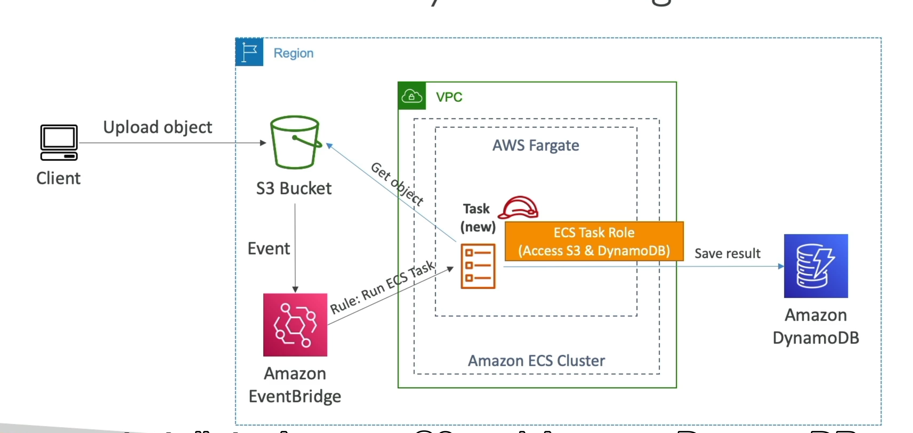
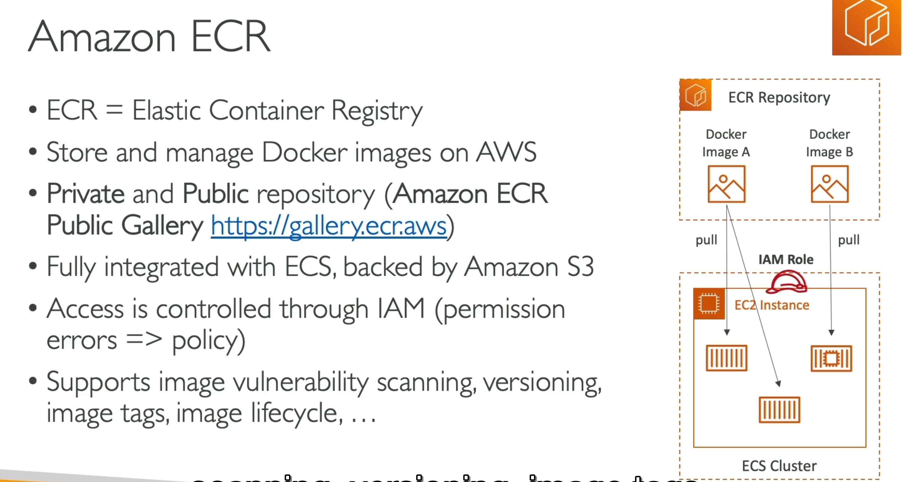

# AWS Containers – ECS, Fargate, ECR, EKS & App Runner

## 1. Docker Introduction

Docker is a platform used to package applications and their dependencies into **containers**.

A container includes everything required to run an application consistently across different environments.

### Key Concepts

- **Docker Image** → Template used to create containers
- **Docker Container** → Running instance of an image
- **Dockerfile** → Instructions used to build an image
- **Docker Registry** → Repository used to store Docker images

Containers are lightweight compared to virtual machines because they share the host operating system kernel.

---

## 2. Amazon ECS

**Amazon Elastic Container Service (ECS)** is AWS's native container orchestration service.

It is used to deploy, manage, and scale Docker containers.

### ECS Architecture

**ECS Cluster → ECS Service → ECS Tasks → Containers**

### Task Definition

A **Task Definition** is the blueprint describing how containers should run.

It can define:

- Docker image
- CPU
- Memory
- Port mappings
- Environment variables
- IAM roles
- Logging configuration

A running instance of a Task Definition is called an **ECS Task**.

---

## 3. Creating an ECS Cluster

An **ECS Cluster** is a logical grouping of ECS tasks and services.

The cluster provides the environment where containerized applications are deployed.

### Screenshot – ECS Cluster

---

## 4. Creating an ECS Service

An **ECS Service** ensures that a specified number of tasks are continuously running.

For example:

**Desired count = 3**

ECS maintains **3 running tasks**.

If one task fails, ECS automatically launches another one.

ECS Services can integrate with an **Application Load Balancer (ALB)** to distribute traffic between containers.

### Screenshot – ECS Service

### Screenshot – Running Tasks

---

## 5. AWS Fargate

**AWS Fargate** is a serverless compute engine for containers.

With Fargate, AWS manages the underlying infrastructure.

You only configure:

- CPU
- Memory
- Container image
- Networking

You don't need to provision or manage EC2 instances.

> **Exam Tip:** Fargate = run containers without managing EC2 instances.

### Screenshot – Fargate Task

---

## 6. Amazon ECS Auto Scaling

ECS Service Auto Scaling automatically increases or decreases the number of running tasks.

Scaling can be based on:

- CPU utilization
- Memory utilization
- Application Load Balancer request count
- CloudWatch metrics

Typical flow:

**Traffic increases → CloudWatch metric increases → ECS Auto Scaling → More ECS Tasks**

### Screenshot – ECS Auto Scaling

---

## 7. ECS Solution Architecture

A common highly available ECS architecture is:

**Users → Application Load Balancer → ECS Service → ECS Tasks**

Tasks can be distributed across multiple Availability Zones.

ECS applications can integrate with:

- Amazon RDS
- Amazon DynamoDB
- Amazon S3
- Amazon CloudWatch
- AWS Secrets Manager

### Screenshot – ECS Architecture

---

## 8. Amazon ECR

**Amazon Elastic Container Registry (ECR)** is AWS's managed container image registry.

It is used to store and manage Docker images.

### Typical Workflow

**Developer → Build Docker Image → Push to ECR → ECS/Fargate pulls Image → Container runs**

ECR supports:

- Private repositories
- IAM permissions
- Image scanning
- Encryption

### Screenshot – ECR Repository

---

## 9. Amazon EKS

**Amazon Elastic Kubernetes Service (EKS)** is AWS's managed Kubernetes service.

Kubernetes is an open-source container orchestration platform.

AWS manages the Kubernetes **control plane**, while workloads can run on:

- Amazon EC2
- AWS Fargate

### ECS vs EKS

| ECS | EKS |
|---|---|
| AWS-native | Kubernetes |
| Simpler | More complex |
| Deep AWS integration | Kubernetes ecosystem |
| No Kubernetes required | Kubernetes knowledge required |

> **Exam Tip:** If the question explicitly requires **Kubernetes**, think **Amazon EKS**.

---

## 10. AWS App Runner

**AWS App Runner** allows developers to deploy web applications and APIs without managing the underlying infrastructure.

Applications can be deployed from:

- Source code
- Container images stored in Amazon ECR

AWS automatically handles:

- Deployment
- Load balancing
- Auto Scaling
- HTTPS
- Infrastructure management

### Typical Architecture

**Source Code / ECR Image → App Runner → Public Web Application**

App Runner is useful when you want a simple way to deploy a containerized web application without managing ECS infrastructure yourself.

---

# ECS Concepts to Remember

## ECS Cluster

Logical grouping where ECS services and tasks run.

## Task Definition

Blueprint describing how the container should run.

**Task Definition → Task**

A Task Definition contains configuration such as:

- Docker image
- CPU
- RAM
- Ports
- Environment variables
- IAM roles

## ECS Task

A **Task** is a running instance of a Task Definition.

## ECS Service

A Service maintains a desired number of Tasks.

Example:

**Desired Tasks = 3**

If one dies:

**3 Tasks → 1 fails → ECS launches another → 3 Tasks**

## Fargate

Fargate provides the compute required to run the containers without managing EC2 servers.

The important relationship is:

**ECS = orchestration**

**Fargate = compute**

---

# Container Architecture to Remember

A common workflow is:

**Docker Image → Amazon ECR → Amazon ECS → AWS Fargate**

### Step 1 – Docker

The application is packaged into a Docker image.

### Step 2 – ECR

The Docker image is pushed to an **Amazon ECR repository**.

### Step 3 – ECS

Amazon ECS manages the deployment and lifecycle of the containers.

### Step 4 – Fargate

AWS Fargate provides the infrastructure required to run the containers.

---

# Exam Cheat Sheet

| Service | What to Remember |
|---|---|
| **Docker** | Package applications into containers |
| **ECS** | AWS-native container orchestration |
| **Fargate** | Serverless compute for containers |
| **ECR** | Store Docker/container images |
| **EKS** | Managed Kubernetes |
| **ECS Cluster** | Logical grouping of ECS resources |
| **Task Definition** | Blueprint/configuration of a container workload |
| **ECS Task** | Running instance of a Task Definition |
| **ECS Service** | Maintains the desired number of Tasks |
| **ECS Auto Scaling** | Automatically changes the number of Tasks |
| **App Runner** | Simple deployment of web apps and APIs |

---

# Key Exam Scenarios

### "Run containers without managing servers"

→ **AWS Fargate**

### "Store Docker images"

→ **Amazon ECR**

### "AWS-native container orchestration"

→ **Amazon ECS**

### "Kubernetes on AWS"

→ **Amazon EKS**

### "Maintain 5 running containers"

→ **ECS Service with Desired Count = 5**

### "Automatically add containers when CPU increases"

→ **ECS Service Auto Scaling**

### "Quickly deploy a web application from source code or a container image"

→ **AWS App Runner**

---

# Final Summary

The most important relationship for the SAA exam is:

**ECR → stores the image**

**ECS → orchestrates the containers**

**Fargate → runs the containers without EC2 management**

**EKS → Kubernetes on AWS**

**App Runner → simplified web application deployment**

And the basic ECS hierarchy is:

**Cluster → Service → Task → Container**
