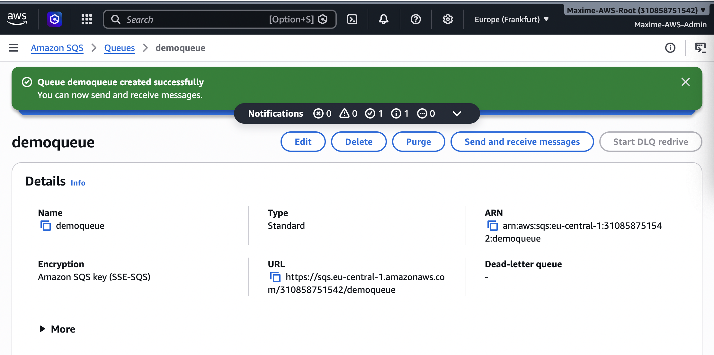
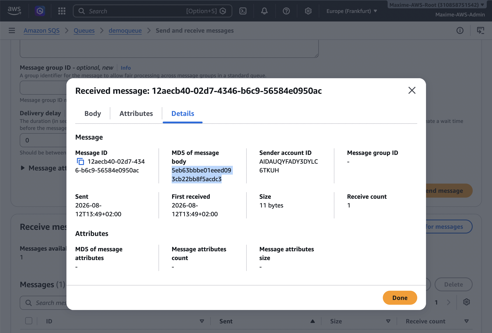
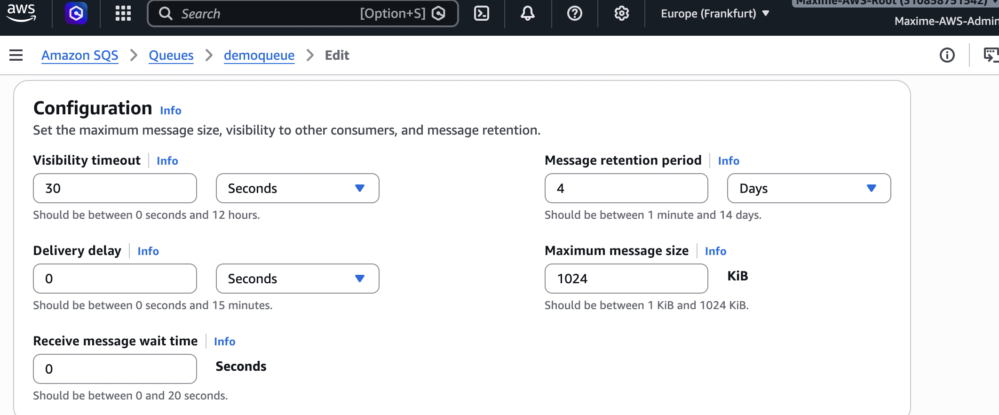
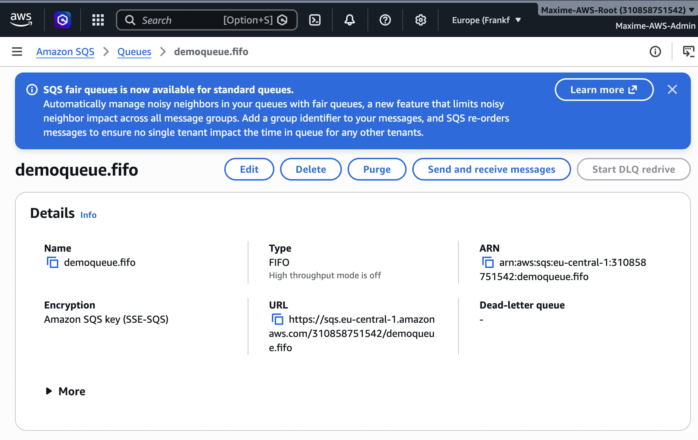
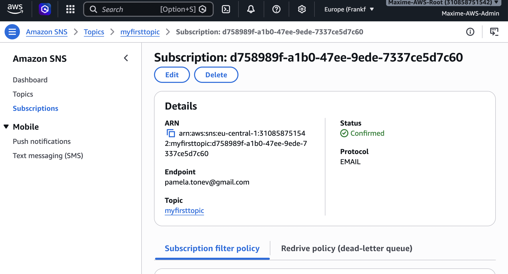
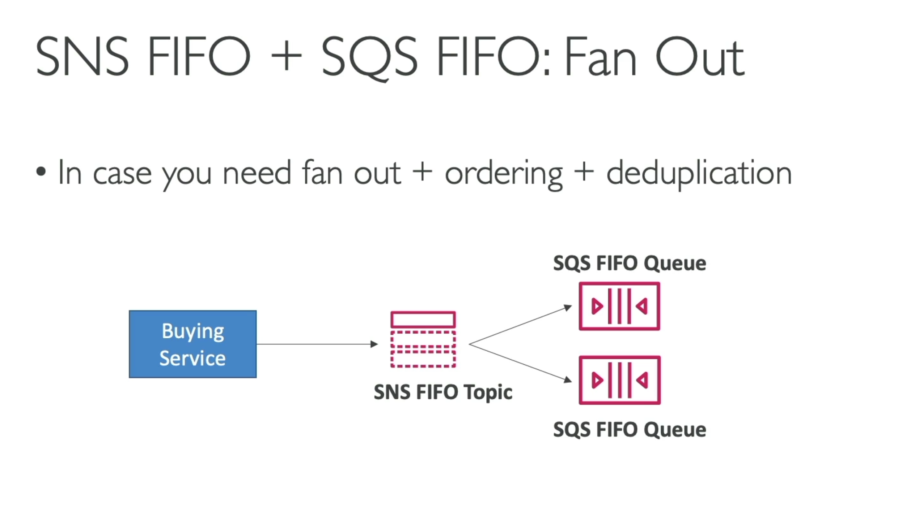
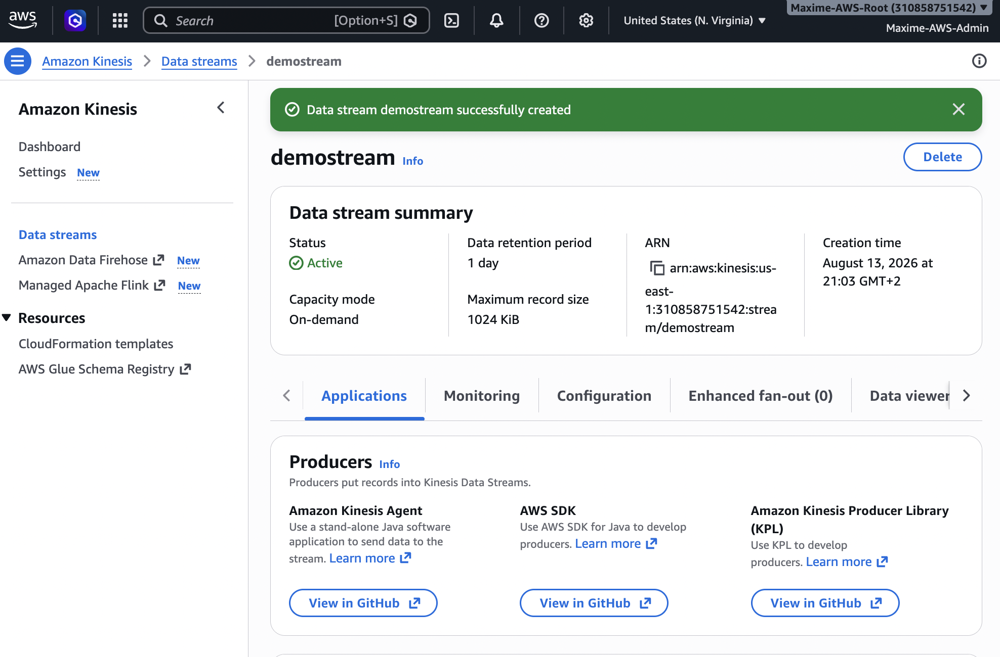
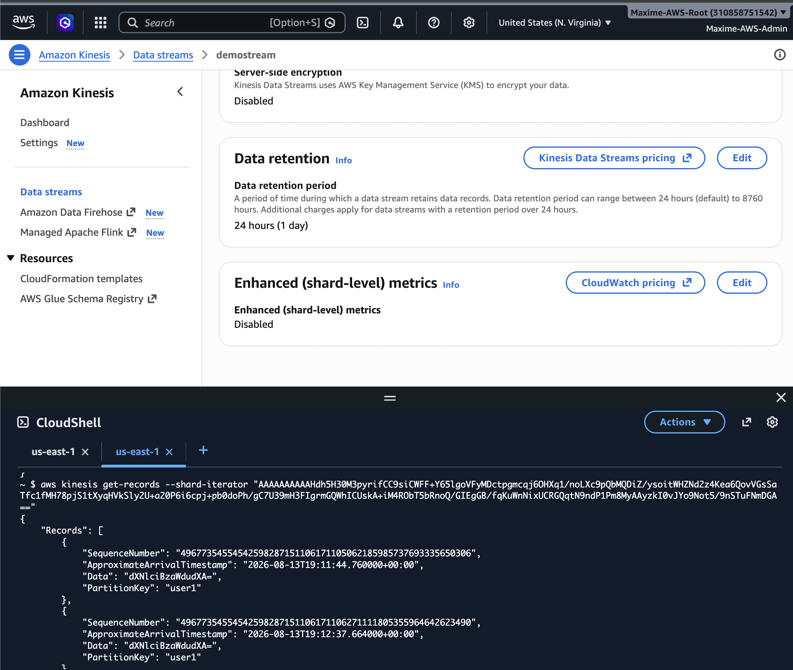
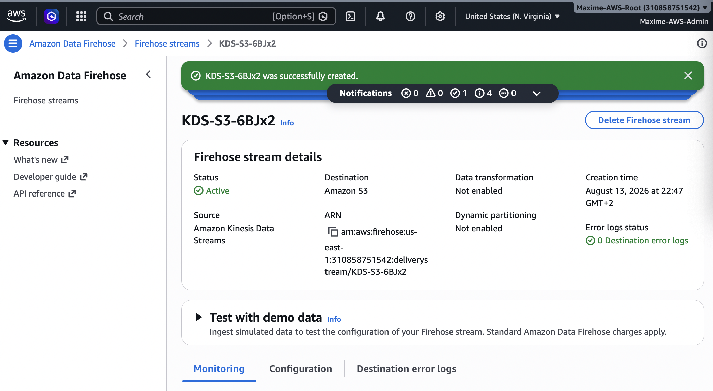
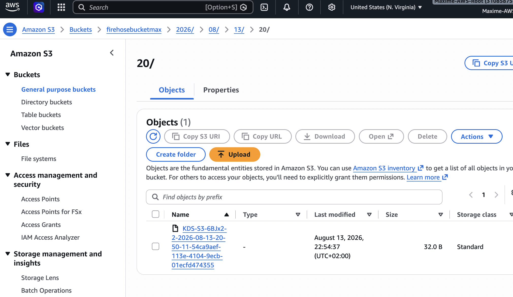

# AWS Messaging – SQS, SNS, Kinesis & Amazon MQ

## Overview

This project explores the main AWS messaging and streaming services used to build **decoupled, scalable, and resilient architectures**.

Services covered:

- Amazon SQS
- Amazon SNS
- Amazon Kinesis Data Streams
- Amazon Data Firehose
- Amazon MQ

---

## 1. Amazon SQS

Amazon Simple Queue Service (SQS) is a fully managed message queuing service used to **decouple application components**.

A producer sends messages to a queue, while consumers retrieve and process them independently.

```text
Producer → SQS Queue → Consumer
```

### SQS Standard Queue

Standard queues provide:

- Nearly unlimited throughput
- At-least-once delivery
- Best-effort ordering
- Automatic scalability

### Hands-on – Standard Queue



### Sending and Receiving Messages

Messages can be sent by producers and retrieved by consumers.



---

## 2. SQS Visibility Timeout

When a consumer receives a message, the message temporarily becomes invisible to other consumers.

If the message is successfully processed, the consumer deletes it.

If it is not deleted before the **Visibility Timeout** expires, it becomes visible again.

```text
Message received
      ↓
Visibility Timeout
      ↓
 ┌─────────────┐
 │             │
Deleted     Timeout
 │             │
 ▼             ▼
Done      Visible again
```



---

## 3. SQS Long Polling

Long Polling allows SQS to wait for messages instead of immediately returning an empty response.

Benefits:

- Fewer empty responses
- Fewer API requests
- Lower costs
- Better efficiency

---

## 4. SQS FIFO Queues

FIFO stands for **First-In-First-Out**.

FIFO queues are designed for workloads where message ordering and duplicate prevention are important.

They provide:

- Strict ordering within a Message Group
- Message deduplication
- Exactly-once processing behavior
- Message Group IDs

FIFO queue names end with:

```text
.fifo
```

Example:

```text
orders.fifo
```



---

## 5. SQS + Auto Scaling Group

SQS can be combined with an EC2 Auto Scaling Group.

```text
Producer
   ↓
SQS Queue
   ↓
EC2 Auto Scaling Group
   ↓
Workers
```

The Auto Scaling Group can scale according to the number of messages waiting in the queue.

This allows processing capacity to automatically adapt to workload demand.

---

## 6. Amazon SNS

Amazon Simple Notification Service (SNS) is a fully managed **publish/subscribe (Pub/Sub)** messaging service.

Publishers send messages to an SNS Topic, which pushes the messages to its subscribers.

Subscribers can include:

- Amazon SQS
- AWS Lambda
- HTTP/HTTPS endpoints
- Email
- SMS

```text
             ┌──→ SQS
             │
Publisher → SNS Topic ──→ Lambda
             │
             └──→ HTTP / Email / SMS
```

### Hands-on – SNS Topic



---

## 7. SNS + SQS Fan-Out Pattern

SNS and SQS can be combined to implement a **Fan-Out Pattern**.

One message published to an SNS Topic can be distributed to multiple independent SQS queues.

```text
                     ┌──→ SQS Queue A
                     │
Producer → SNS Topic ┼──→ SQS Queue B
                     │
                     └──→ SQS Queue C
```

This provides:

- Decoupling
- Independent processing
- Fault isolation
- Scalability



---

## 8. Amazon Kinesis Data Streams

Amazon Kinesis Data Streams is designed for **real-time streaming data ingestion and processing**.

Typical use cases include:

- Application logs
- Clickstreams
- IoT telemetry
- Metrics
- Financial transactions
- Real-time analytics

```text
Producers
    ↓
Kinesis Data Stream
    ↓
  Shards
    ↓
Consumers
```

Records with the same **Partition Key** are sent to the same shard.

Ordering is therefore guaranteed within a shard.

### Hands-on – Kinesis Data Stream



### Sending Records



---

## 9. Amazon Data Firehose

Amazon Data Firehose is a fully managed service used to deliver streaming data to destinations such as:

- Amazon S3
- Amazon Redshift
- Amazon OpenSearch Service
- HTTP endpoints

```text
Data Source
    ↓
Amazon Data Firehose
    ↓
Buffer / Transform
    ↓
Destination
```

Unlike Kinesis Data Streams, Firehose manages infrastructure and scaling automatically.

### Hands-on – Firehose Delivery Stream



### Data Delivered to S3



---

## 10. Data Ordering – Kinesis vs SQS FIFO

Both services can provide ordered processing, but they use different mechanisms.

### SQS FIFO

Ordering is maintained within a **Message Group ID**.

```text
Message Group A
1 → 2 → 3 → 4
```

### Kinesis Data Streams

Ordering is maintained within a **Shard**.

Records using the same partition key are routed to the same shard.

```text
Partition Key
     ↓
   Shard
     ↓
1 → 2 → 3 → 4
```

---

## 11. SQS vs SNS vs Kinesis

| Service | Main Purpose | Model | Ordering | Typical Use |
|---|---|---|---|---|
| SQS Standard | Message Queue | Pull | Best effort | Application decoupling |
| SQS FIFO | Ordered Queue | Pull | Yes | Ordered processing |
| SNS | Pub/Sub | Push | Topic dependent | Notifications / Fan-out |
| Kinesis Data Streams | Streaming | Stream | Per shard | Real-time processing |
| Data Firehose | Delivery | Managed | Not primary purpose | Deliver streaming data |

---

## 12. Amazon MQ

Amazon MQ is a managed message broker service supporting:

- Apache ActiveMQ
- RabbitMQ

It is mainly useful when migrating existing applications that already rely on traditional messaging protocols.

```text
Legacy Application
       ↓
    Amazon MQ
       ↓
Application / Consumer
```

For new cloud-native AWS applications, services such as **SQS and SNS** are generally preferred.

---

## Key Takeaways

### SQS

Use **SQS** for asynchronous processing and application decoupling.

### SNS

Use **SNS** when one event must be pushed to multiple subscribers.

### SNS + SQS

Use **SNS + SQS** for fan-out architectures.

```text
                  ┌→ SQS → Consumer
                  │
Producer → SNS ───┼→ SQS → Consumer
                  │
                  └→ SQS → Consumer
```

### Kinesis Data Streams

Use **Kinesis Data Streams** for high-throughput real-time streaming where consumers need access to the stream.

### Data Firehose

Use **Data Firehose** when streaming data needs to be automatically delivered to destinations such as Amazon S3.

### Amazon MQ

Use **Amazon MQ** primarily when migrating applications using ActiveMQ, RabbitMQ, or traditional messaging protocols.

---

## Skills Demonstrated

- Amazon SQS Standard Queues
- Amazon SQS FIFO Queues
- Visibility Timeout
- Long Polling
- SQS with Auto Scaling
- Amazon SNS Topics
- SNS + SQS Fan-Out
- Amazon Kinesis Data Streams
- Kinesis Shards and Partition Keys
- Amazon Data Firehose
- Streaming data delivery
- Amazon MQ fundamentals
- AWS messaging architecture selection
