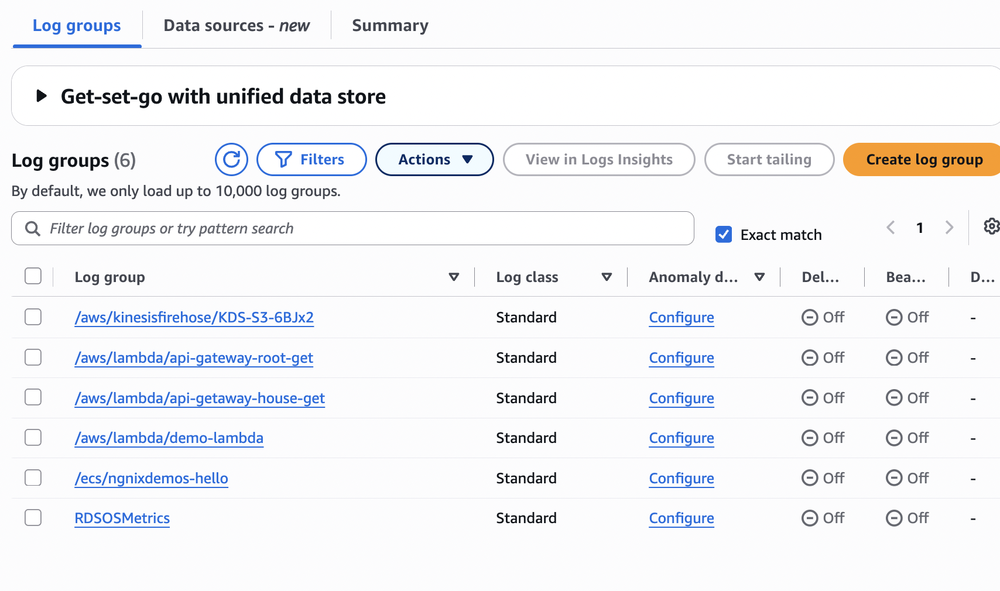
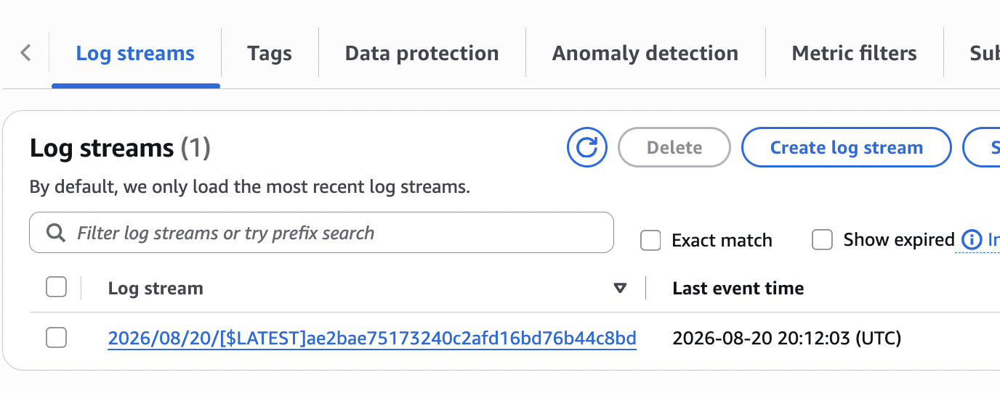
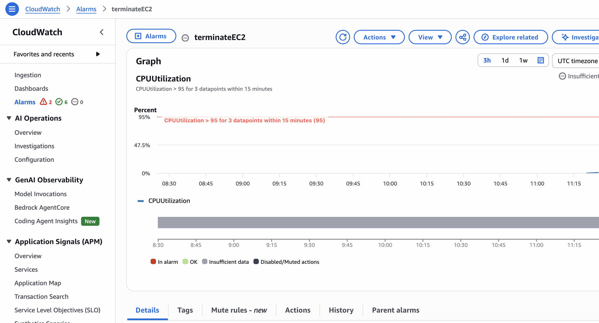
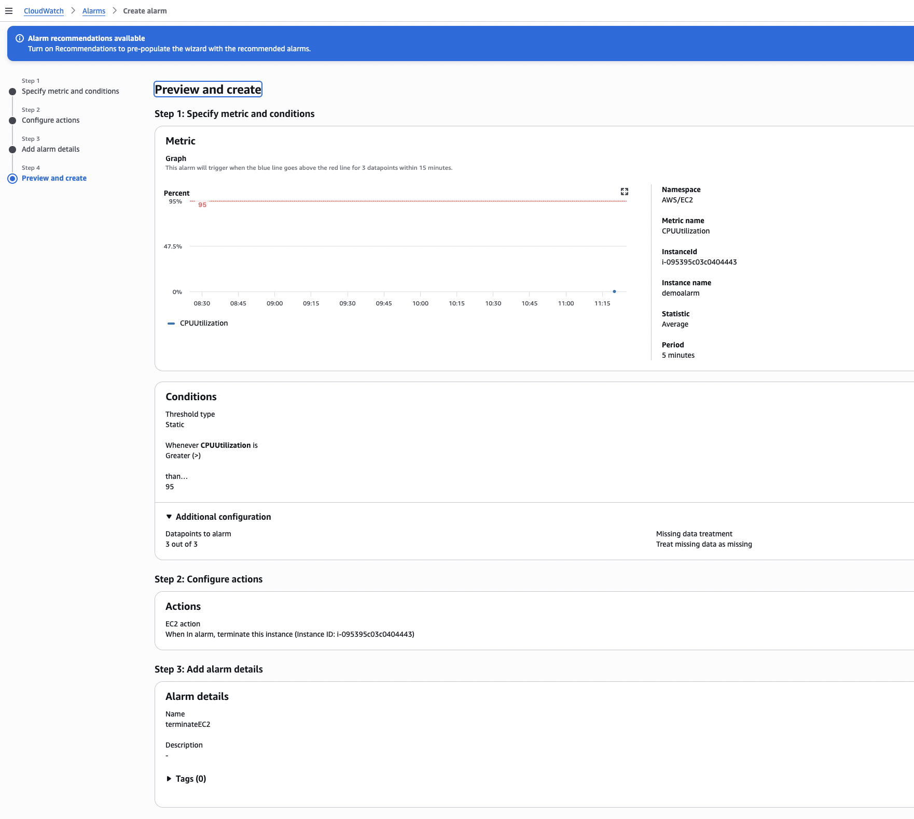
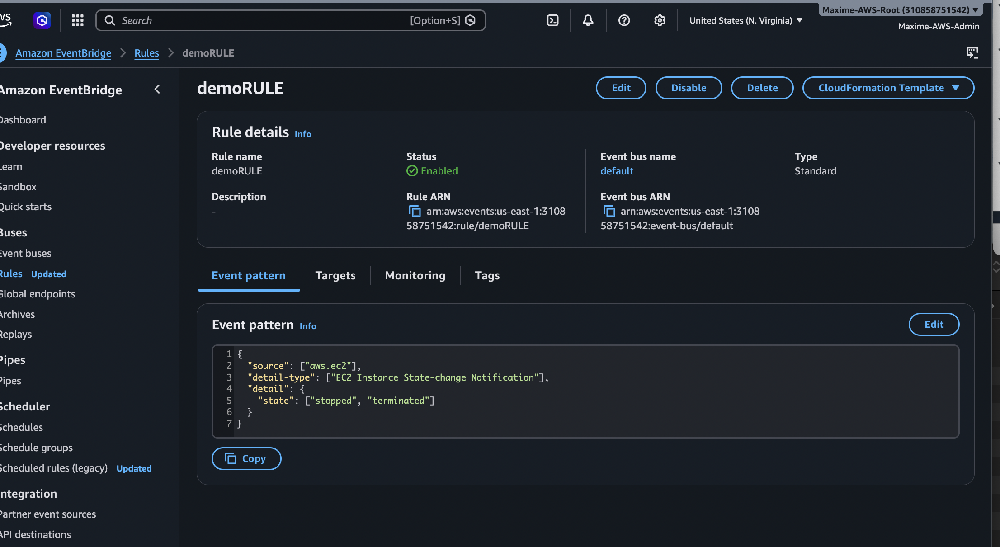
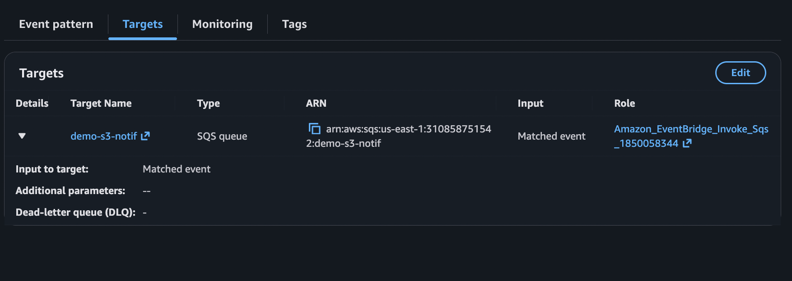
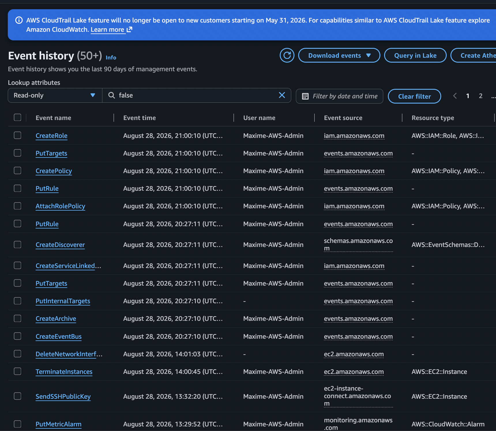
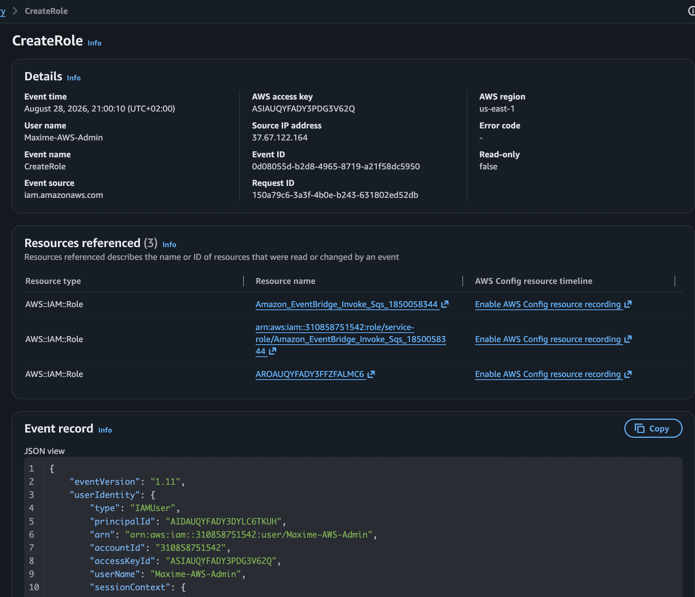

# AWS Monitoring, Auditing & Event Management

## Overview

This section covers the main AWS services used to monitor resources, collect logs, audit API activity, react to events, and track configuration changes.

Services covered:

- Amazon CloudWatch
- Amazon EventBridge
- AWS CloudTrail
- AWS Config

---

# 1. Amazon CloudWatch

Amazon CloudWatch is the main AWS monitoring and observability service.

It allows us to monitor AWS resources and applications using:

- Metrics
- Logs
- Alarms
- Dashboards
- Insights

---

## 1.1 CloudWatch Metrics

CloudWatch Metrics are numerical measurements collected over time.

Examples include:

- EC2 CPU utilization
- Network traffic
- EBS operations
- RDS database connections
- Lambda invocations
- Lambda errors

A CloudWatch metric contains information such as:

- Namespace
- Metric name
- Dimensions
- Timestamp
- Value

### Important

Many AWS services automatically publish metrics to CloudWatch.

For EC2, metrics such as **CPU utilization and network activity** are available by default.

However, operating-system metrics such as:

- RAM usage
- Disk space usage

require the **CloudWatch Agent**.

---

# 2. CloudWatch Logs

CloudWatch Logs allows applications and AWS services to send and store logs centrally.

Common log sources include:

- EC2 instances
- Lambda functions
- ECS containers
- CloudTrail
- Applications
- On-premises servers

The basic hierarchy is:

```text
CloudWatch Logs
      │
      └── Log Group
              │
              ├── Log Stream
              ├── Log Stream
              └── Log Stream
```

A **Log Group** usually represents an application or service.

A **Log Stream** represents a particular source, instance, or execution environment.

---

## CloudWatch Logs Hands-On

In this lab, CloudWatch Logs are used to inspect and manage logs generated by AWS resources or applications.

### Screenshot 01 — CloudWatch Log Group

```markdown

```

### Screenshot 02 — CloudWatch Log Stream

```markdown

```

---

# 3. CloudWatch Agent

The CloudWatch Agent can be installed on:

- EC2 instances
- On-premises servers

It allows CloudWatch to collect additional operating-system metrics and logs.

Examples include:

- RAM usage
- Disk usage
- Processes
- Custom logs
- System-level metrics

### Key Exam Point

```text
EC2 CPU Utilization
        ↓
Available by default


EC2 RAM / Disk Usage
        ↓
CloudWatch Agent required
```

---

# 4. CloudWatch Alarms

CloudWatch Alarms monitor CloudWatch metrics and perform actions when predefined thresholds are reached.

Example:

```text
EC2 CPU > 80%
      ↓
CloudWatch Alarm
      ↓
SNS Notification
```

CloudWatch Alarms can have three states:

- `OK`
- `ALARM`
- `INSUFFICIENT_DATA`

Possible actions include:

- SNS notifications
- Auto Scaling actions
- EC2 actions

---

## CloudWatch Alarms Hands-On

In this lab, a CloudWatch Alarm is configured to monitor a metric and react when a defined threshold is exceeded.

### Screenshot 03 — CloudWatch Alarm

```markdown

```

### Screenshot 04 — Alarm Configuration

```markdown

```

---

# 5. Amazon EventBridge

Amazon EventBridge is a serverless event bus service.

It allows AWS services and applications to react automatically to events.

Basic architecture:

```text
Event Source
     ↓
EventBridge
     ↓
Rule
     ↓
Target
```

Possible targets include:

- AWS Lambda
- Amazon SNS
- Amazon SQS
- AWS Step Functions
- ECS Tasks

### Example

An EC2 instance changes state:

```text
EC2 Instance Stops
        ↓
EventBridge Rule
        ↓
Lambda Function
```

EventBridge can also execute actions on a schedule.

Example:

```text
Every day at 08:00
        ↓
EventBridge
        ↓
Lambda
```

---

## EventBridge Hands-On

In this lab, an EventBridge rule is created to react to an AWS event and route the event to a target.

### Screenshot 05 — EventBridge Rule

```markdown

```

### Screenshot 06 — EventBridge Target

```markdown

```

---

# 6. CloudWatch Insights & Operational Visibility

CloudWatch provides tools for analyzing and visualizing operational data.

CloudWatch Logs Insights allows us to search and analyze log data using queries.

Typical use cases include:

- Finding application errors
- Analyzing Lambda failures
- Searching API logs
- Investigating incidents
- Troubleshooting applications

Example architecture:

```text
Application
     ↓
CloudWatch Logs
     ↓
Logs Insights
     ↓
Query / Analyze Logs
```

---

# 7. AWS CloudTrail

AWS CloudTrail records API activity performed inside an AWS account.

CloudTrail essentially answers:

> **Who did what in AWS?**

For example:

```text
User deletes an S3 bucket
        ↓
CloudTrail records:
        │
        ├── Who performed the action
        ├── Which API call was used
        ├── When it happened
        ├── Source IP address
        └── Target resource
```

CloudTrail records actions performed through:

- AWS Management Console
- AWS CLI
- AWS SDK
- AWS services

### Example

An EC2 instance suddenly gets terminated.

The company needs to determine which user performed the action.

→ **AWS CloudTrail**

---

## CloudTrail Hands-On

In this lab, CloudTrail Event History is used to inspect API activity inside the AWS account.

### Screenshot 07 — CloudTrail Event History

```markdown

```

### Screenshot 08 — CloudTrail Event Details

```markdown

```

---

# 8. CloudTrail + EventBridge Integration

CloudTrail and EventBridge can work together to detect and react to AWS API activity.

For example:

```text
User modifies a Security Group
            ↓
        CloudTrail
            ↓
       EventBridge
            ↓
           SNS
            ↓
      Security Team
```

CloudTrail provides the audit information.

EventBridge allows an automated reaction to the event.

This architecture can be useful for security monitoring and automated incident response.

---

# 9. AWS Config

AWS Config records and evaluates the **configuration of AWS resources over time**.

It can be used for:

- Compliance monitoring
- Configuration history
- Resource tracking
- Configuration rules
- Detecting non-compliant resources

### Example

A company requires all S3 buckets to have encryption enabled.

An AWS Config rule can continuously evaluate the buckets:

```text
AWS Config Rule
       ↓
Check S3 Encryption
       ↓
 ┌─────────────┐
 │             │
 ▼             ▼
Compliant   Non-Compliant
```

### Important

AWS Config does NOT primarily answer:

> Who changed this resource?

That is the role of **CloudTrail**.

AWS Config answers questions such as:

> How is this resource configured?

and:

> Is this resource compliant with our rules?

---

## AWS Config Hands-On

In this lab, AWS Config is used to evaluate AWS resource configurations and compliance.

### Screenshot 09 — AWS Config

```markdown

```

### Screenshot 10 — AWS Config Compliance

```markdown

```

---

# 10. CloudWatch vs CloudTrail vs AWS Config

Understanding the difference between these three services is extremely important for the AWS exam.

| Service | Main Purpose | Main Question |
|---|---|---|
| **CloudWatch** | Monitoring | What is happening with my resources? |
| **CloudTrail** | Auditing | Who did what in my AWS account? |
| **AWS Config** | Configuration & Compliance | How is my resource configured and is it compliant? |

---

## Example 1 — High CPU

An EC2 instance is experiencing unusually high CPU utilization.

Which service should be used?

→ **Amazon CloudWatch**

---

## Example 2 — Deleted Resource

An EC2 instance was terminated and the company wants to know which user performed the action.

Which service should be used?

→ **AWS CloudTrail**

---

## Example 3 — Compliance

A company wants to continuously verify that all S3 buckets have encryption enabled.

Which service should be used?

→ **AWS Config**

---

# 11. Exam Cheat Sheet

```text
Metrics / Monitoring
        ↓
CloudWatch


Centralized Logs
        ↓
CloudWatch Logs


RAM / Disk Metrics on EC2
        ↓
CloudWatch Agent


Metric Exceeds Threshold
        ↓
CloudWatch Alarm


React to AWS Events
        ↓
EventBridge


Scheduled Serverless Event
        ↓
EventBridge


Who performed an AWS API action?
        ↓
CloudTrail


Resource Configuration / Compliance
        ↓
AWS Config
```

---

# 12. Architecture Summary

```text
                    AWS Environment
                          │
          ┌───────────────┼───────────────┐
          │               │               │
          ▼               ▼               ▼
     CloudWatch       CloudTrail       AWS Config
          │               │               │
      Monitoring        Auditing       Compliance
          │               │          Configuration
          │               │
     Metrics & Logs    API Activity
          │
          ▼
        Alarms
          │
          ▼
         SNS


                    AWS Events
                        │
                        ▼
                   EventBridge
                        │
             ┌──────────┼──────────┐
             │          │          │
             ▼          ▼          ▼
           Lambda      SNS        SQS
                        │
                        ▼
                  Step Functions
```

---

# 13. Key Takeaways

After completing this section, I understand how AWS provides monitoring, auditing, event-driven automation, and configuration tracking.

The main concepts to remember are:

- **CloudWatch** monitors AWS resources and applications.
- **CloudWatch Logs** centralizes log data.
- **CloudWatch Agent** collects additional OS-level metrics such as RAM and disk usage.
- **CloudWatch Alarms** react to metric thresholds.
- **EventBridge** routes events to targets and enables event-driven architectures.
- **CloudTrail** records AWS API activity and user actions.
- **AWS Config** tracks resource configuration and compliance.

The most important distinction for the exam is:

```text
CloudWatch = What is happening?

CloudTrail = Who did it?

AWS Config = Is the configuration compliant?

EventBridge = What should happen when an event occurs?
```
