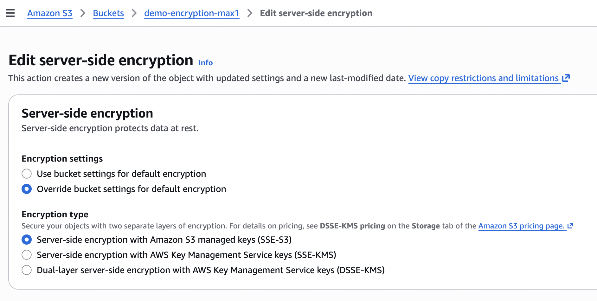
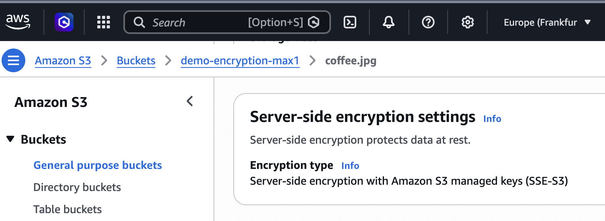
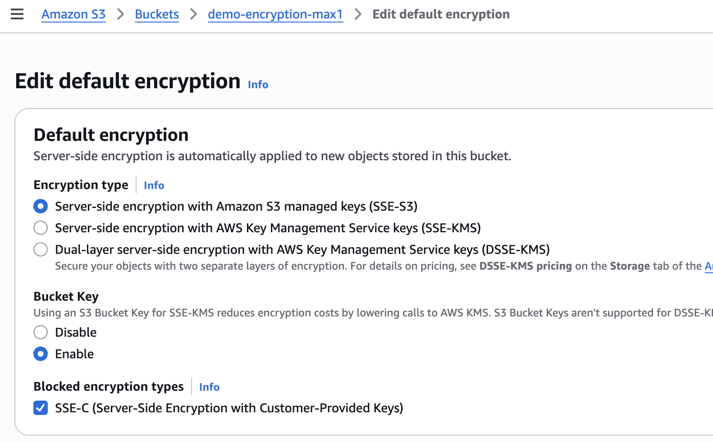
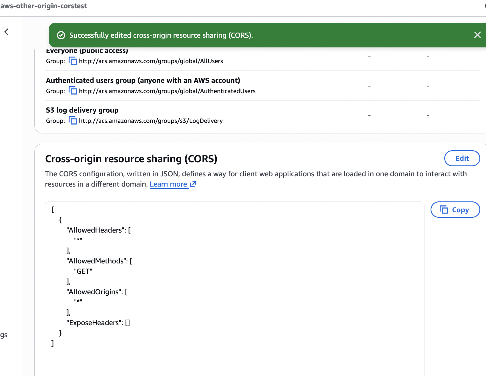
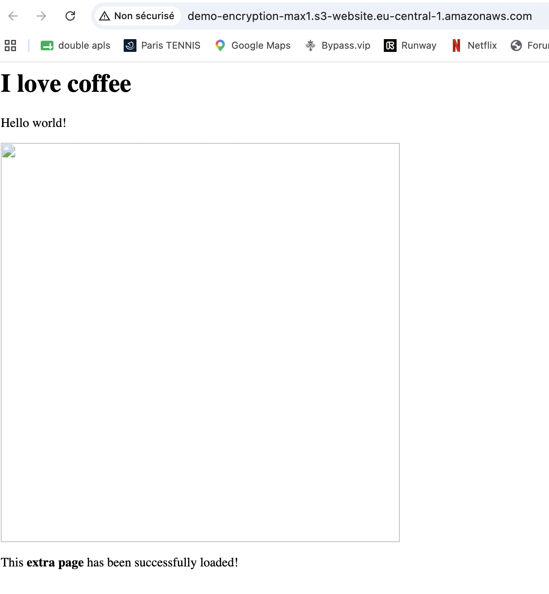
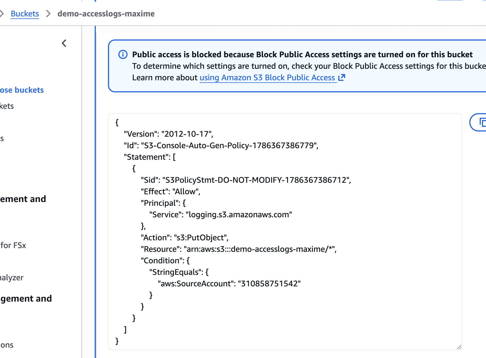
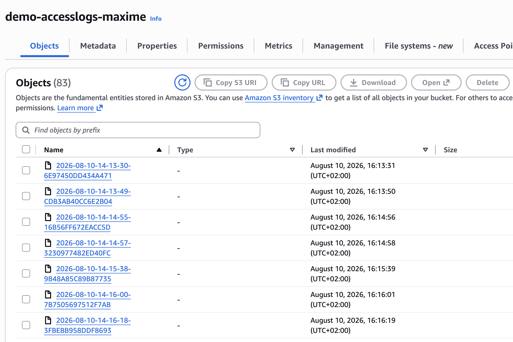
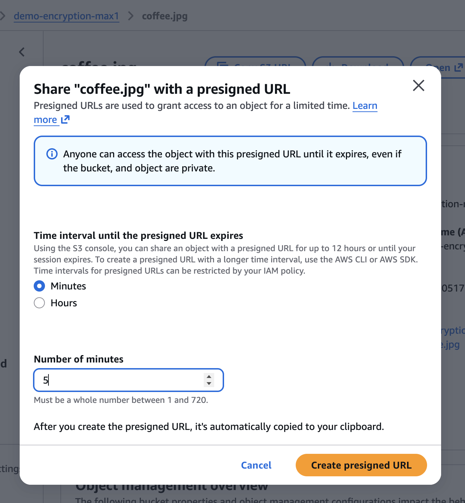
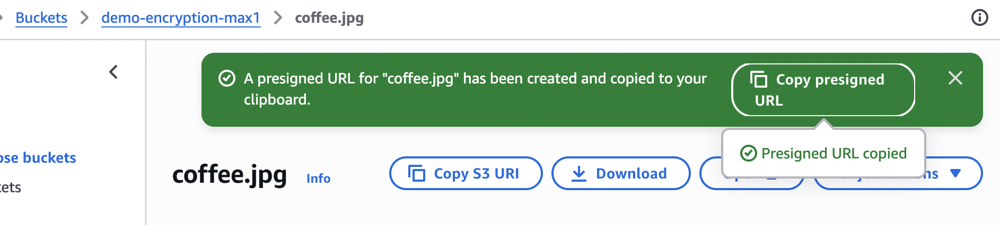

# AWS S3 – Advanced Security & Access

This repository documents advanced Amazon S3 security, encryption, access control, logging, and object protection features.

The goal of this lab is to understand how Amazon S3 protects data at rest, controls access to objects, generates temporary access, and enforces data retention policies.

---

## 1. S3 Encryption

Amazon S3 provides several methods to encrypt objects at rest.

### Server-Side Encryption

The main server-side encryption options are:

- **SSE-S3** – Encryption keys are managed by AWS.
- **SSE-KMS** – Encryption keys are managed through AWS Key Management Service (KMS).
- **SSE-C** – The customer provides and manages the encryption key.

Amazon S3 encrypts the object before storing it and decrypts it when the object is downloaded.

### Client-Side Encryption

With client-side encryption, the object is encrypted before being uploaded to Amazon S3.

The client is responsible for managing the encryption process and encryption keys.

### Hands-On

---

## 2. S3 Default Encryption

Amazon S3 supports default encryption at the bucket level.

When default encryption is enabled, new objects uploaded to the bucket are automatically encrypted.

Possible encryption methods include:

- SSE-S3
- SSE-KMS

Default encryption helps ensure that objects cannot accidentally be stored without encryption.

### Hands-On

---

## 3. S3 CORS

Cross-Origin Resource Sharing (CORS) allows web applications hosted on one domain to access resources stored in an S3 bucket hosted on another domain.

A CORS configuration can define:

- Allowed origins
- Allowed HTTP methods
- Allowed headers
- Exposed headers

Typical HTTP methods include:

- GET
- PUT
- POST
- DELETE
- HEAD

### Hands-On

---

## 4. S3 MFA Delete

MFA Delete adds an additional security layer to sensitive S3 operations.

Multi-Factor Authentication is required when performing operations such as:

- Permanently deleting an object version
- Changing the versioning state of the bucket

MFA Delete works together with S3 Versioning.

It provides additional protection against accidental or malicious deletion of objects.

---

## 5. S3 Access Logs

S3 Server Access Logging records detailed information about requests made to a bucket.

Logs can include information such as:

- Requester
- Bucket name
- Request time
- HTTP operation
- Response status
- Object key

The logs are delivered to another S3 bucket.

This feature is useful for:

- Security auditing
- Access analysis
- Troubleshooting

### Hands-On

---

## 6. S3 Pre-Signed URLs

Pre-signed URLs provide temporary access to private S3 objects.

The URL is generated using the permissions of the AWS identity that creates it.

A pre-signed URL contains an expiration time.

Typical use cases include:

- Temporary file downloads
- Temporary file uploads
- Sharing private objects
- Providing application users temporary access to S3 resources

### Hands-On

---

## 7. Glacier Vault Lock & S3 Object Lock

Amazon S3 provides mechanisms to prevent objects from being modified or deleted.

### Glacier Vault Lock

Glacier Vault Lock allows a retention policy to be permanently enforced on an Amazon S3 Glacier vault.

It can be used to meet regulatory and compliance requirements.

### S3 Object Lock

S3 Object Lock uses a **WORM** model:

> Write Once Read Many

Once protected, an object version cannot be modified or deleted during its retention period.

S3 Object Lock provides two retention modes.

### Governance Mode

Users with specific permissions can override or modify the retention settings.

### Compliance Mode

Protected object versions cannot be overwritten or deleted by any user, including the root user, until the retention period expires.

### Legal Hold

A Legal Hold can prevent an object from being deleted without requiring a specific retention period.

### Hands-On

---

## 8. S3 Access Points

S3 Access Points simplify access management for buckets that are used by multiple applications, teams, or services.

Each Access Point can have:

- Its own DNS endpoint
- Its own access policy
- Specific permissions
- Specific network restrictions

Instead of maintaining one complex bucket policy, different applications can use dedicated Access Points.

### Hands-On

---

## 9. S3 Object Lambda

S3 Object Lambda allows applications to modify or transform S3 objects when they are retrieved.

AWS Lambda functions can process the object before returning it to the application.

Possible use cases include:

- Redacting sensitive information
- Resizing images
- Converting file formats
- Filtering data
- Customizing objects for different applications

The original object stored in S3 remains unchanged.

### Architecture

Application → S3 Object Lambda Access Point → AWS Lambda → S3 Object

### Hands-On

---

## Key Takeaways

After completing this lab, I learned how to:

- Encrypt Amazon S3 objects using different encryption methods
- Configure default bucket encryption
- Configure Cross-Origin Resource Sharing (CORS)
- Protect object versions using MFA Delete
- Enable and analyze S3 Server Access Logs
- Generate temporary access using Pre-Signed URLs
- Protect objects using S3 Object Lock
- Understand Governance and Compliance retention modes
- Configure S3 Access Points
- Understand how S3 Object Lambda transforms objects dynamically

---

## AWS Services Used

- Amazon S3
- AWS Key Management Service (KMS)
- AWS Lambda
- Amazon S3 Glacier
- AWS Identity and Access Management (IAM)
