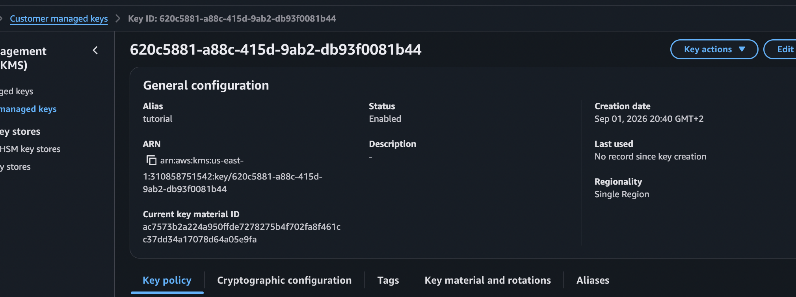
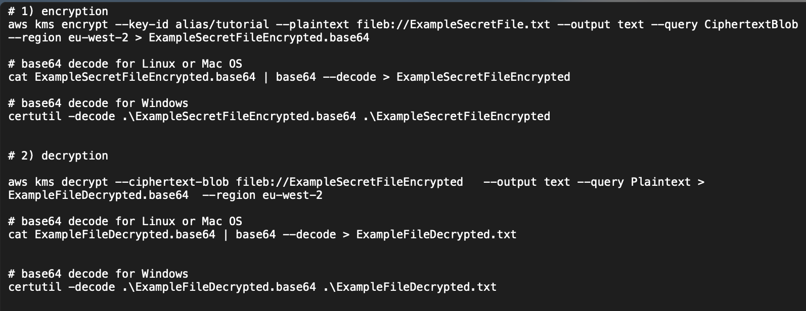
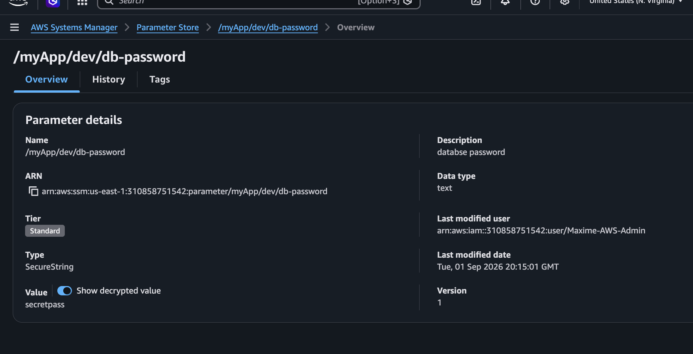
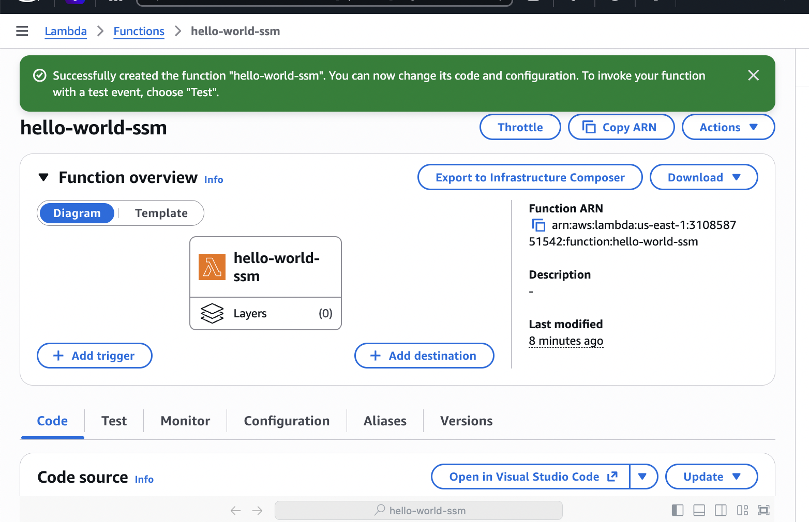
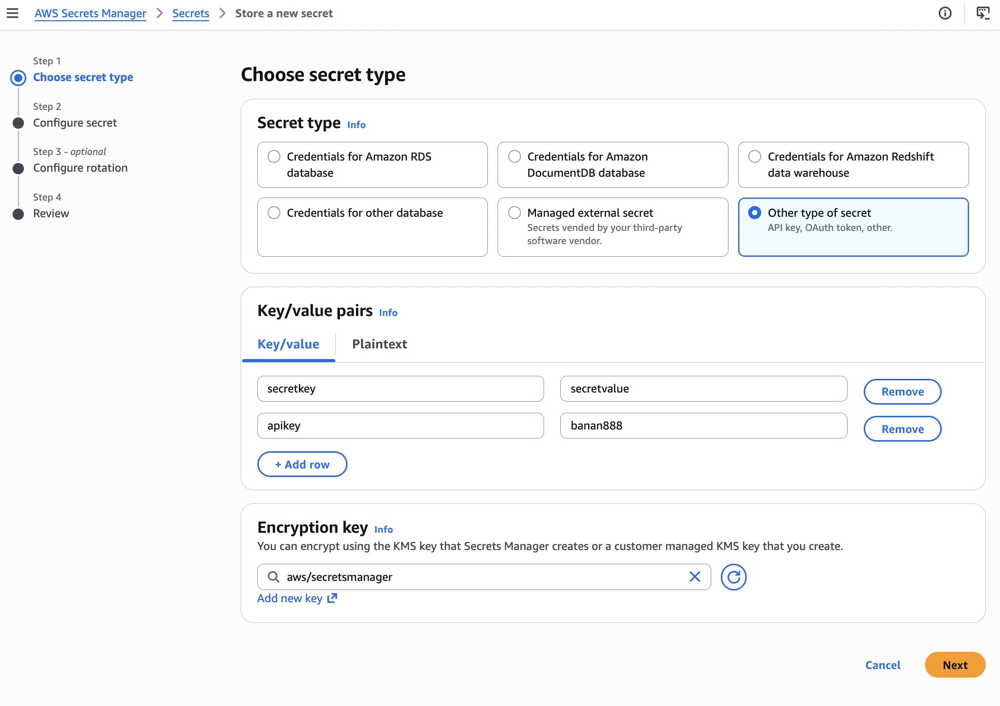

# 🔐 AWS Security

This project covers the main AWS security services and concepts used to protect data, applications, infrastructure, and credentials.

The section focuses on encryption with AWS KMS, secure configuration and secrets management, TLS certificates, web application protection, DDoS protection, and threat detection services such as GuardDuty, Inspector, and Macie.

---

## 📚 Topics Covered

- Encryption fundamentals
- AWS Key Management Service (KMS)
- KMS Multi-Region Keys
- S3 Replication with encryption
- Encrypted AMI sharing
- AWS Systems Manager Parameter Store
- AWS Secrets Manager
- AWS Certificate Manager (ACM)
- AWS Web Application Firewall (WAF)
- AWS Shield
- AWS Firewall Manager
- DDoS protection best practices
- Amazon GuardDuty
- Amazon Inspector
- Amazon Macie

---

# 1. Encryption Fundamentals

Encryption protects data from unauthorized access.

AWS commonly distinguishes between two states of data:

### Encryption at Rest

Data stored on disks, databases, S3 buckets, EBS volumes, snapshots, or other storage services can be encrypted.

AWS services can use encryption keys managed through **AWS KMS**.

Examples:

- S3 objects
- EBS volumes
- RDS databases
- DynamoDB tables
- Snapshots
- Secrets

### Encryption in Transit

Data moving between systems should be encrypted using protocols such as **TLS/HTTPS**.

For example:

```text
Client
   │
   │ HTTPS / TLS
   ▼
Application Load Balancer
   │
   ▼
EC2
```

AWS Certificate Manager can provide the TLS certificates used for HTTPS.

### Client-Side Encryption

Data can also be encrypted before being sent to AWS.

```text
Application
     │
     │ Encrypt locally
     ▼
Encrypted Data
     │
     ▼
AWS
```

This means AWS receives data that is already encrypted.

---

# 2. AWS Key Management Service (KMS)

AWS KMS is a managed service used to create and control cryptographic keys.

KMS integrates with many AWS services including:

- Amazon S3
- Amazon EBS
- Amazon RDS
- DynamoDB
- Lambda
- Secrets Manager
- Systems Manager Parameter Store

KMS keys can be used to encrypt data while maintaining centralized control over key permissions.

Important concepts:

- KMS Keys
- Key Policies
- IAM Policies
- Automatic Key Rotation
- Encryption / Decryption permissions
- Audit through CloudTrail

---

## KMS Key

A KMS Key represents the cryptographic key managed by AWS KMS.

Access to the key is controlled mainly through:

- Key policies
- IAM policies
- Grants

Typical permissions include:

```text
kms:Encrypt
kms:Decrypt
kms:GenerateDataKey
kms:DescribeKey
```

### Screenshot



---

# 3. KMS Encryption with AWS CLI

AWS KMS can be used directly through the AWS CLI.

Example encryption operation:

```bash
aws kms encrypt \
  --key-id alias/my-key \
  --plaintext fileb://secret.txt \
  --output text \
  --query CiphertextBlob
```

The encrypted result can then be stored or transferred securely.

To decrypt data:

```bash
aws kms decrypt \
  --ciphertext-blob fileb://encrypted-file \
  --output text \
  --query Plaintext
```

KMS permissions must allow the user or role to perform the requested operation.

### Screenshot



---

# 4. KMS Multi-Region Keys

KMS Multi-Region Keys allow related KMS keys to exist in multiple AWS Regions.

Architecture:

```text
Region A
Primary KMS Key
      │
      │ Replication
      ▼
Region B
Replica KMS Key
```

The keys share the same key material but are managed independently in each Region.

This can be useful for:

- Disaster recovery
- Multi-region applications
- Global architectures
- Cross-region encrypted data

A replica can also be promoted to become a primary key.


# 5. S3 Replication with Encryption

Amazon S3 supports replication between buckets.

Examples:

- Cross-Region Replication (CRR)
- Same-Region Replication (SRR)

When objects are encrypted with SSE-KMS, replication requires additional KMS permissions.

Example architecture:

```text
S3 Bucket
Region A
    │
    │ Replication
    ▼
S3 Bucket
Region B
```

For KMS encrypted objects:

```text
Source KMS Key
      │
      ▼
S3 Replication
      │
      ▼
Destination KMS Key
```

The replication IAM role must have permission to use the appropriate KMS keys.


# 6. Encrypted AMI Sharing

Encrypted Amazon Machine Images can be shared between AWS accounts.

However, sharing the AMI alone is not enough.

The destination account must also be authorized to use the KMS key protecting the encrypted snapshots.

Typical process:

```text
Account A
   │
   ├── Encrypted AMI
   │
   └── KMS Key
          │
          ▼
       Share
          │
          ▼
Account B
```

The KMS Key Policy must allow the destination account to use the key.

This is an important difference between sharing:

- Unencrypted AMIs
- Encrypted AMIs

---

# 7. AWS Systems Manager Parameter Store

AWS Systems Manager Parameter Store provides centralized storage for configuration values.

Parameters can contain:

- Database URLs
- Application configuration
- API endpoints
- Passwords
- Tokens

Parameter Store supports three parameter types:

```text
String
StringList
SecureString
```

`SecureString` parameters can be encrypted using AWS KMS.

Architecture:

```text
Application
     │
     ▼
SSM Parameter Store
     │
     ▼
SecureString
     │
     ▼
AWS KMS
```

### Screenshot



---

# 8. Parameter Store with AWS CLI

Parameters can be retrieved using the AWS CLI.

Example:

```bash
aws ssm get-parameter \
  --name "/my-app/database-password" \
  --with-decryption
```

The caller requires permissions such as:

```text
ssm:GetParameter
```

and potentially:

```text
kms:Decrypt
```

when the parameter uses a customer-managed KMS key.

---

# 9. Parameter Store with AWS Lambda

AWS Lambda functions can retrieve configuration or secrets stored inside Parameter Store.

Typical architecture:

```text
Lambda
   │
   │ IAM Role
   ▼
Parameter Store
   │
   ▼
KMS
```

The Lambda execution role needs permission to access the parameter.

For example:

```text
ssm:GetParameter
```

If the value is encrypted, KMS permissions may also be required.

### Screenshot



---

# 10. AWS Secrets Manager

AWS Secrets Manager is designed specifically for storing and managing secrets.

Examples:

- Database passwords
- API keys
- Authentication credentials
- Application secrets

Secrets are encrypted using AWS KMS.

Architecture:

```text
Application
     │
     ▼
Secrets Manager
     │
     ▼
Encrypted Secret
     │
     ▼
AWS KMS
```

### Screenshot



---

# 11. Secrets Manager Rotation

One major feature of Secrets Manager is **automatic secret rotation**.

For supported services, AWS can periodically replace credentials.

Example:

```text
Secrets Manager
      │
      ▼
Rotation
      │
      ▼
Lambda
      │
      ▼
Database
```

This reduces the need to manually manage long-lived credentials.

Typical use case:

```text
Application
     │
     ▼
Secrets Manager
     │
     ▼
RDS Password
```

The application retrieves the current password dynamically instead of hardcoding it.

### Screenshot


---

# 12. Parameter Store vs Secrets Manager

| Feature | Parameter Store | Secrets Manager |
|---|---|---|
| Configuration storage | ✅ | ✅ |
| Secret storage | ✅ | ✅ |
| KMS encryption | ✅ | ✅ |
| Automatic secret rotation | Limited | ✅ |
| Database credential management | Possible | Designed for it |
| Simple configuration values | Excellent | Possible |

A simple rule:

```text
Configuration → Parameter Store

Credentials requiring rotation → Secrets Manager
```

---

# 13. AWS Certificate Manager (ACM)

AWS Certificate Manager manages SSL/TLS certificates.

Certificates allow applications to use HTTPS.

ACM integrates with services such as:

- Application Load Balancer
- CloudFront
- API Gateway

Example:

```text
User
 │
 │ HTTPS
 ▼
Load Balancer
 │
 │ ACM Certificate
 ▼
Application
```

ACM can automatically renew eligible certificates issued by AWS.

Certificate validation can use:

- DNS validation
- Email validation

DNS validation is generally preferred because renewal can remain automated.

### Screenshot


---

# 14. AWS Web Application Firewall (WAF)

AWS WAF protects web applications from malicious HTTP/HTTPS requests.

It can be associated with services such as:

- CloudFront
- Application Load Balancer
- API Gateway

WAF uses **Web ACLs** containing rules.

Example:

```text
Internet
   │
   ▼
AWS WAF
   │
   ├── Allow
   ├── Block
   └── Count
   │
   ▼
Application
```

Rules can inspect:

- IP addresses
- HTTP headers
- Query strings
- URI paths
- Request bodies

WAF can help mitigate attacks such as:

- SQL injection
- Cross-Site Scripting (XSS)
- Malicious bots
- Suspicious IP traffic

AWS also provides managed rule groups.

### Screenshot


---

# 15. AWS Shield

AWS Shield provides protection against Distributed Denial of Service attacks.

There are two main levels:

### AWS Shield Standard

Automatically enabled for AWS customers.

Provides basic protection against common network and transport layer DDoS attacks.

### AWS Shield Advanced

Provides additional protection for critical applications.

Features include:

- Advanced DDoS detection
- Enhanced mitigation
- Cost protection
- Access to the AWS Shield Response Team

Typical architecture:

```text
Internet
   │
   ▼
Shield
   │
   ▼
CloudFront / ALB
   │
   ▼
Application
```

---

# 16. AWS Firewall Manager

AWS Firewall Manager allows security policies to be centrally managed across multiple AWS accounts.

It is particularly useful with **AWS Organizations**.

Firewall Manager can centrally manage services such as:

- AWS WAF
- AWS Shield Advanced
- Security Groups
- AWS Network Firewall

Example:

```text
AWS Organizations
       │
       ▼
Firewall Manager
       │
       ├── Account A
       ├── Account B
       ├── Account C
       └── Account D
```

This helps enforce consistent security policies across an organization.

---

# 17. WAF & Shield

WAF and Shield protect against different types of attacks.

```text
                    Internet
                       │
                       ▼
                 AWS Shield
                 DDoS Protection
                       │
                       ▼
                    AWS WAF
               HTTP Filtering
                       │
                       ▼
                  CloudFront
                       │
                       ▼
                Load Balancer
                       │
                       ▼
                  Application
```

Simplified:

```text
Shield → DDoS protection

WAF → Web request filtering
```

### Screenshot


---

# 18. DDoS Protection Best Practices

AWS provides several services that can be combined to improve resilience against DDoS attacks.

Typical architecture:

```text
Users
  │
  ▼
Route 53
  │
  ▼
CloudFront
  │
  ▼
AWS WAF + Shield
  │
  ▼
Application Load Balancer
  │
  ▼
Auto Scaling Group
```

Important strategies include:

- Using CloudFront
- Using Route 53
- Using AWS Shield
- Filtering malicious requests with WAF
- Using Auto Scaling
- Avoiding direct exposure of backend resources

The objective is to absorb, distribute, and filter malicious traffic before it reaches the application.

---

# 19. Amazon GuardDuty

Amazon GuardDuty is a managed threat detection service.

It continuously analyzes AWS activity to identify suspicious behavior.

GuardDuty can analyze signals from sources such as:

- AWS CloudTrail events
- VPC Flow Logs
- DNS logs
- EKS audit logs
- S3 activity
- Runtime monitoring sources

GuardDuty generates **Findings** when suspicious activity is detected.

Examples:

- Compromised EC2 instance
- Suspicious API calls
- Cryptocurrency mining behavior
- Unusual network traffic
- Credential compromise

Architecture:

```text
AWS Activity
     │
     ├── CloudTrail
     ├── VPC
     ├── DNS
     └── Other telemetry
           │
           ▼
       GuardDuty
           │
           ▼
        Findings
```

GuardDuty is primarily about:

> **Threat detection.**

### Screenshot


---

# 20. Amazon Inspector

Amazon Inspector is a vulnerability management service.

It helps identify vulnerabilities in AWS workloads.

Inspector can scan resources such as:

- Amazon EC2 instances
- Container images in Amazon ECR
- AWS Lambda functions

It can identify:

- Software vulnerabilities
- Known CVEs
- Vulnerable packages
- Exposure risks

Architecture:

```text
EC2 / ECR / Lambda
        │
        ▼
Amazon Inspector
        │
        ▼
Vulnerability Findings
```

Inspector is primarily about:

> **Finding vulnerabilities in workloads and software.**

### Screenshot


---

# 21. Amazon Macie

Amazon Macie is a data security and privacy service focused on Amazon S3.

It uses machine learning and pattern matching to discover sensitive data.

Examples include:

- Personally identifiable information (PII)
- Credentials
- Financial information
- Sensitive documents

Architecture:

```text
S3 Buckets
    │
    ▼
Amazon Macie
    │
    ▼
Sensitive Data Discovery
    │
    ▼
Findings
```

Macie can also help identify risky S3 configurations.

Macie is primarily about:

> **Finding sensitive data stored in S3.**

### Screenshot


---

# 🧠 GuardDuty vs Inspector vs Macie

These three services solve different security problems.

| Service | Main Purpose |
|---|---|
| GuardDuty | Detect suspicious activity and threats |
| Inspector | Detect vulnerabilities |
| Macie | Detect sensitive data in S3 |

Easy way to remember:

```text
GuardDuty → "Is someone attacking me?"

Inspector → "Is my software vulnerable?"

Macie → "Do I have sensitive data in S3?"
```

---

# 🔑 KMS vs Parameter Store vs Secrets Manager

Another important distinction:

```text
KMS
│
└── Manages encryption keys

Parameter Store
│
└── Stores configuration and SecureStrings

Secrets Manager
│
└── Stores and rotates secrets
```

These services often work together.

Example:

```text
Application
     │
     ▼
Secrets Manager
     │
     ▼
Encrypted Secret
     │
     ▼
KMS
```

---

# 🛡️ Security Architecture Overview

A simplified AWS security architecture could look like:

```text
                        Internet
                           │
                           ▼
                       Route 53
                           │
                           ▼
                    CloudFront + Shield
                           │
                           ▼
                        AWS WAF
                           │
                           ▼
               Application Load Balancer
                           │
                           ▼
                    EC2 / Lambda
                           │
              ┌────────────┴────────────┐
              │                         │
              ▼                         ▼
       Parameter Store            Secrets Manager
              │                         │
              └──────────┬──────────────┘
                         ▼
                        KMS


Security Monitoring
────────────────────────────────

GuardDuty → Threat Detection

Inspector → Vulnerability Management

Macie → Sensitive Data Discovery
```

---

# 📸 Screenshots

The following screenshots document the main hands-on exercises performed during this section.

```text
screenshots/
│
├── 01-kms-key.png
├── 02-kms-cli-encryption.png
├── 03-kms-multi-region.png
├── 04-s3-replication-encryption.png
├── 05-ssm-securestring.png
├── 06-ssm-lambda.png
├── 07-secrets-manager.png
├── 08-secrets-manager-rotation.png
├── 09-acm-certificate.png
├── 10-waf-web-acl.png
├── 11-waf-shield.png
├── 12-guardduty.png
├── 13-inspector.png
└── 14-macie.png
```

---

# 🎯 Key Takeaways

After completing this section, I understand how AWS provides multiple layers of security:

- **KMS** manages encryption keys.
- **S3 encryption and KMS** protect stored objects.
- **KMS Multi-Region Keys** support multi-region encrypted architectures.
- **Encrypted AMIs** require both AMI and KMS permissions when shared.
- **Parameter Store** securely stores application configuration.
- **Secrets Manager** stores and rotates credentials and secrets.
- **ACM** manages TLS certificates for HTTPS.
- **WAF** filters malicious web requests.
- **Shield** protects against DDoS attacks.
- **Firewall Manager** centrally manages security policies across AWS accounts.
- **GuardDuty** detects suspicious activity and threats.
- **Inspector** identifies software vulnerabilities.
- **Macie** discovers sensitive data stored in S3.

The main principle is that AWS security is implemented in layers:

```text
Encryption
     +
Identity & Permissions
     +
Network / Application Protection
     +
Secret Management
     +
Threat Detection
     +
Vulnerability Management
     +
Data Discovery
```

Together, these services help build a defense-in-depth security architecture on AWS.
