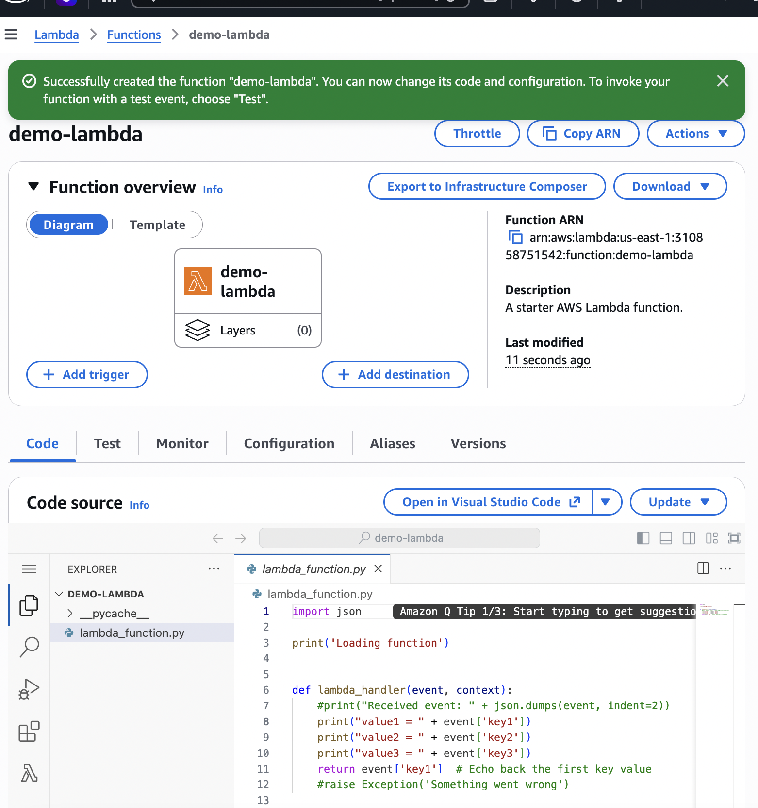
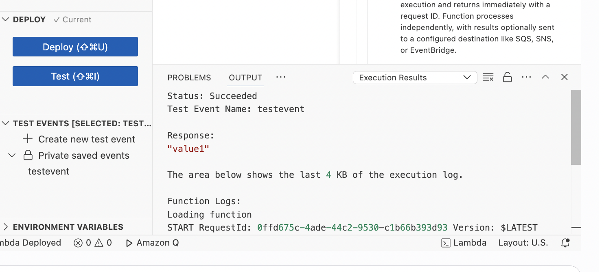
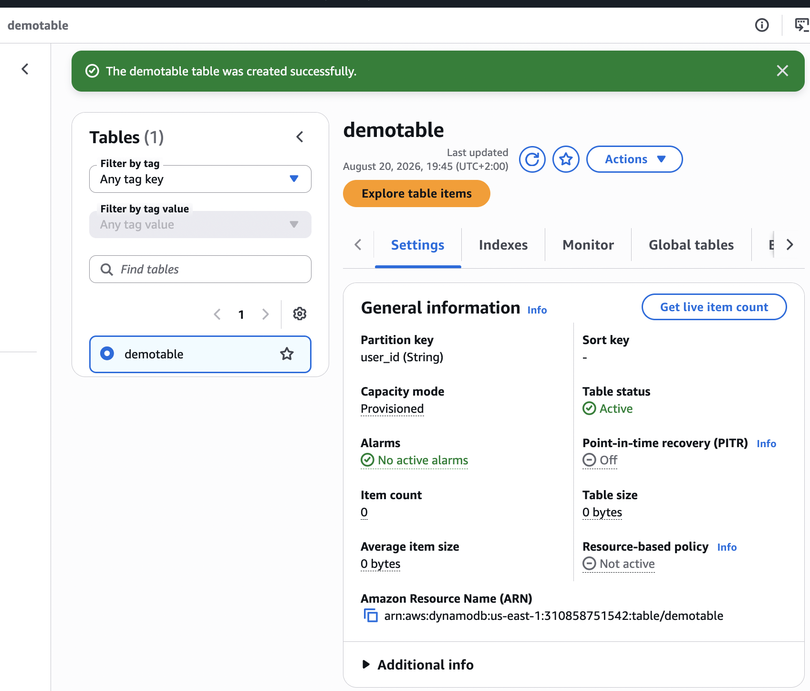
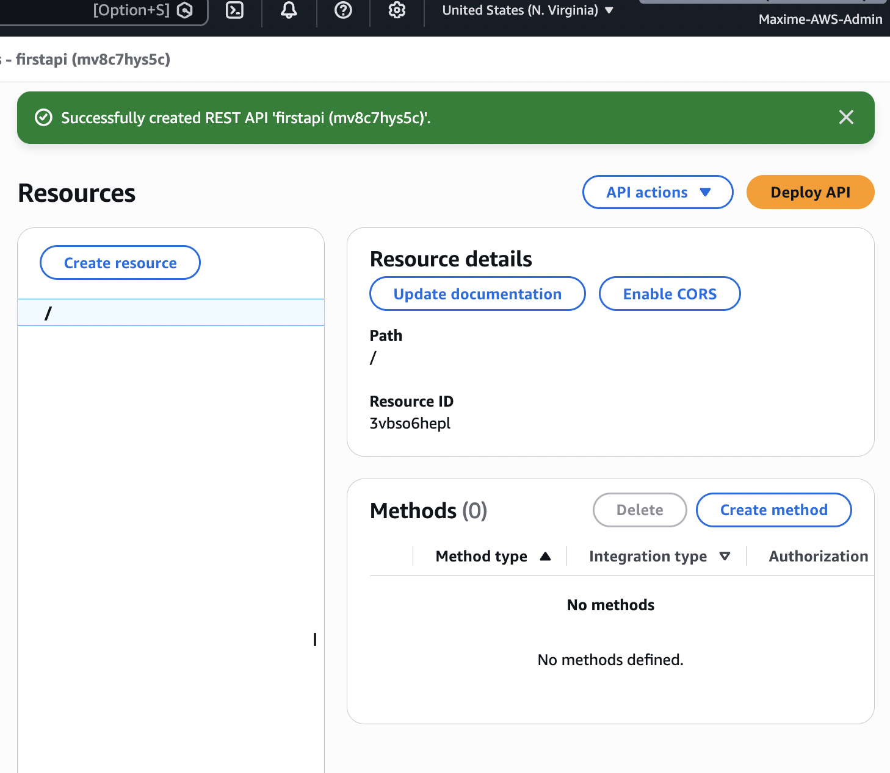
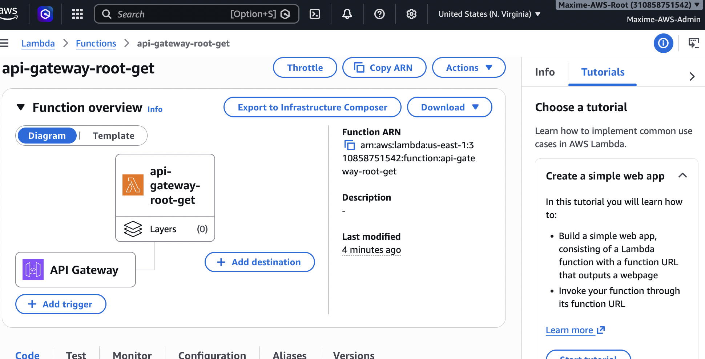
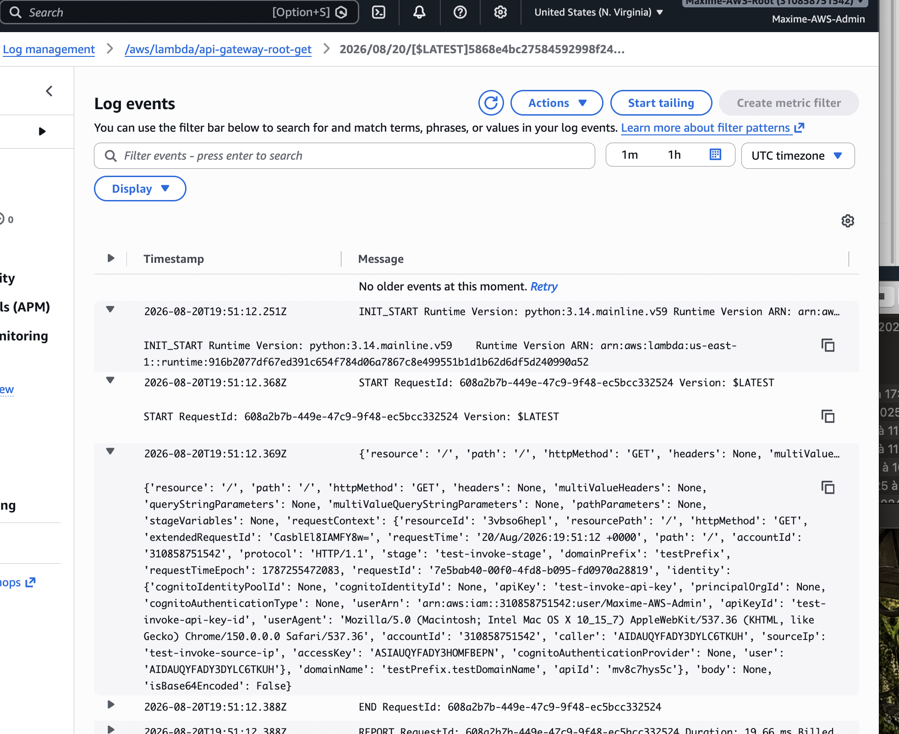

# 🚀 AWS Serverless – Lambda, DynamoDB & API Gateway

## 📌 Overview

This repository documents my hands-on practice with **AWS Serverless services** as part of my AWS Solutions Architect Associate training.

The objective of these labs was to understand how AWS managed services can be combined to build **scalable, event-driven and serverless architectures** without managing traditional servers.

---

## 🏗️ Architecture

```text
Client / Application
        │
        ▼
 Amazon API Gateway
        │
        ▼
    AWS Lambda
        │
        ▼
 Amazon DynamoDB
```

### Request Flow

**Client → API Gateway → Lambda → DynamoDB**

- **Amazon API Gateway** receives HTTP requests.
- **AWS Lambda** executes the application logic.
- **Amazon DynamoDB** provides serverless NoSQL storage.
- **Amazon CloudWatch** provides logs and monitoring.
- **AWS IAM** controls permissions between services.

---

# ⚡ AWS Lambda

AWS Lambda is a serverless compute service that allows code to run without provisioning or managing servers.

During the hands-on labs, I practiced:

- Creating Lambda functions
- Configuring runtimes and execution settings
- Testing functions from the AWS Console
- Configuring IAM execution roles
- Monitoring executions with CloudWatch
- Understanding Lambda limits
- Lambda networking with VPCs
- Lambda SnapStart
- Event-driven invocation

### 📸 Screenshot 01 – Lambda Function



### 📸 Screenshot 02 – Lambda Execution Test



---

# 🗄️ Amazon DynamoDB

Amazon DynamoDB is a fully managed serverless NoSQL database designed for high-performance applications.

During the labs, I covered:

- Creating DynamoDB tables
- Partition keys
- Reading and writing items
- Capacity modes
- DynamoDB Streams
- Time To Live (TTL)
- Global Tables
- Backup and recovery

### 📸 Screenshot 03 – DynamoDB Table



---

# 🌐 Amazon API Gateway

Amazon API Gateway allows applications to expose HTTP APIs backed by AWS services such as Lambda.

Hands-on practice included:

- Creating an API
- Configuring routes and methods
- Integrating API Gateway with Lambda
- Testing API requests
- Understanding request and response handling

### API Flow

```text
HTTP Request
     │
     ▼
API Gateway
     │
     ▼
AWS Lambda
     │
     ▼
DynamoDB
```

### 📸 Screenshot 04 – API Gateway



### 📸 Screenshot 05 – API Gateway → Lambda Integration



---

# 📊 Amazon CloudWatch

Amazon CloudWatch was used to inspect Lambda executions and application logs.

This makes it possible to:

- Monitor Lambda invocations
- Inspect execution logs
- Troubleshoot errors
- Observe application behavior

### 📸 Screenshot 06 – CloudWatch Logs



---

# 🔐 Security

Security concepts covered during the labs include:

- IAM execution roles
- Least-privilege permissions
- Lambda resource-based policies
- API access control
- VPC integration
- CloudWatch monitoring and logging

Each serverless component should only receive the permissions required to perform its intended function.

---

# 🔄 Additional Serverless Concepts

## AWS Step Functions

AWS Step Functions can orchestrate multiple AWS services and Lambda functions using workflows and state machines.

## Amazon Cognito

Amazon Cognito provides authentication, authorization and user management capabilities for web and mobile applications.

## Lambda@Edge & CloudFront Functions

Lambda@Edge and CloudFront Functions allow application logic to execute closer to users through Amazon CloudFront edge locations.

## Lambda with RDS

Lambda functions can interact with relational databases and participate in architectures involving Amazon RDS.


---

# 🧠 Key Takeaways

Through these hands-on labs, I gained practical experience with:

- Building and testing AWS Lambda functions
- Understanding event-driven architectures
- Working with Amazon DynamoDB
- Integrating API Gateway with Lambda
- Managing IAM permissions
- Monitoring Lambda executions with CloudWatch
- Understanding serverless networking
- Working with AWS managed service integrations
- Designing architectures without managing traditional servers

---

# 🎯 Architecture Summary

The core serverless architecture explored throughout these labs is:

**API Gateway → Lambda → DynamoDB**

This architecture provides a **scalable, highly available and fully managed foundation** for building serverless applications on AWS.
