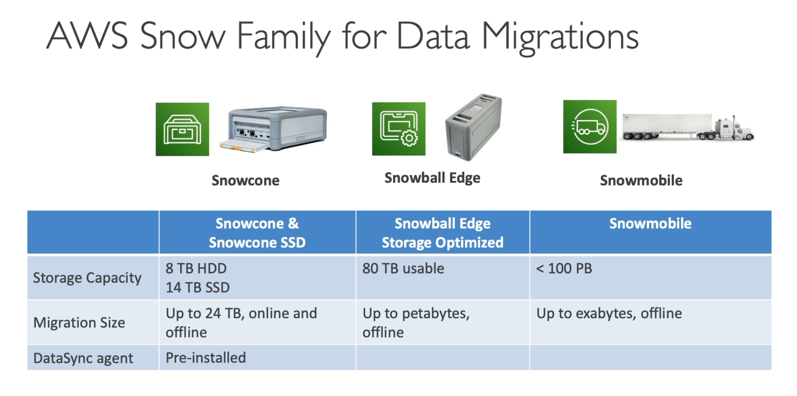
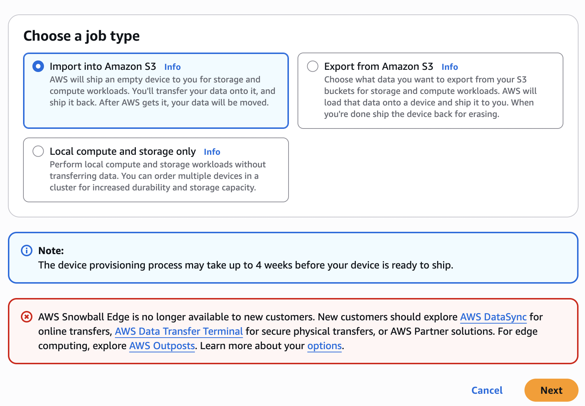
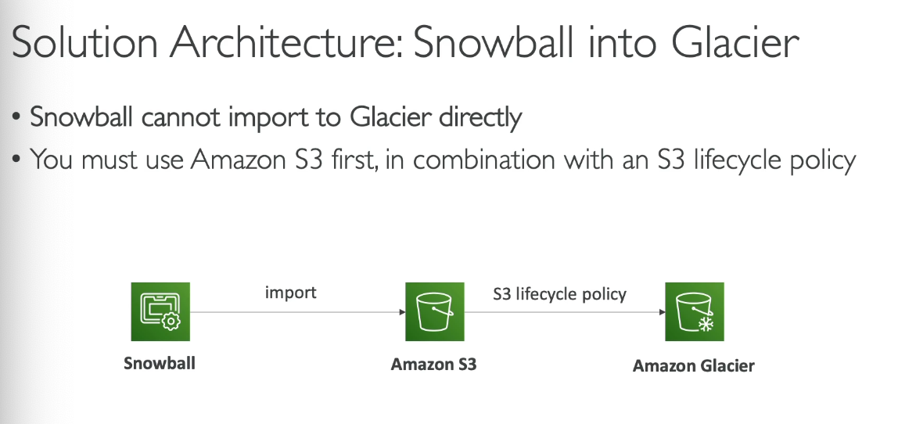
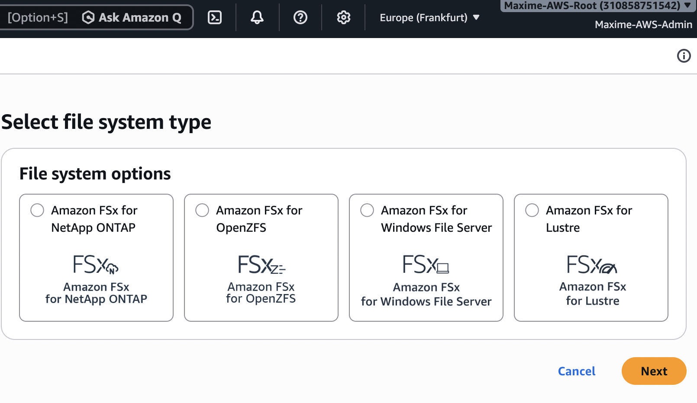
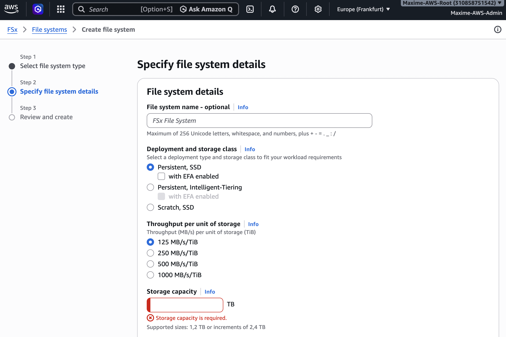
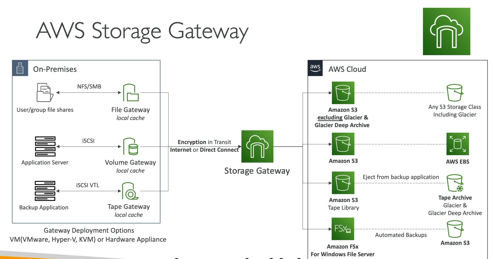
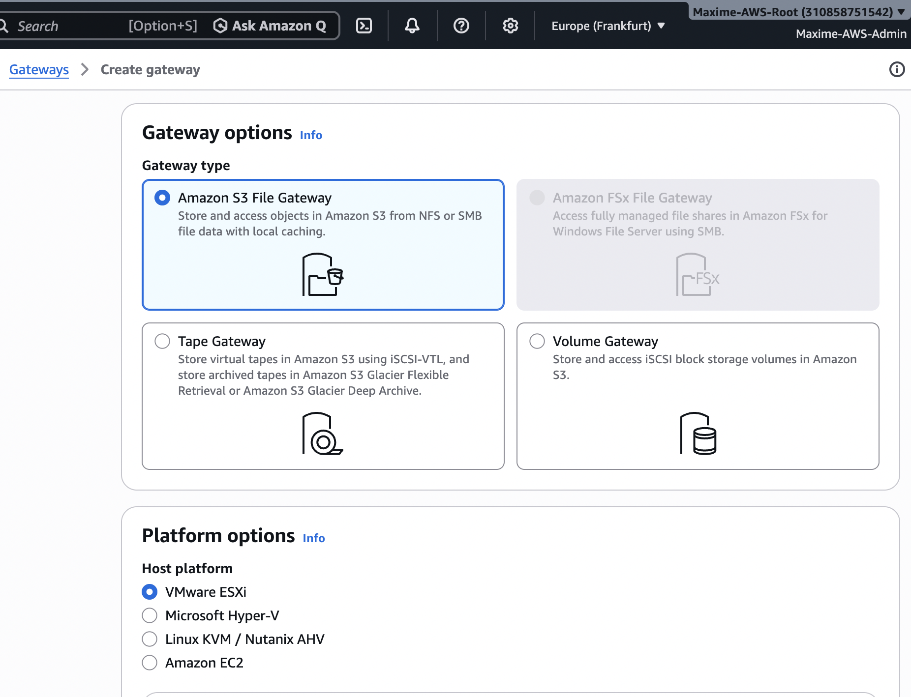
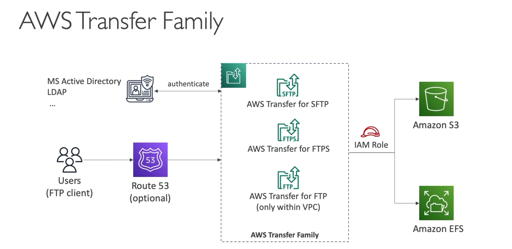
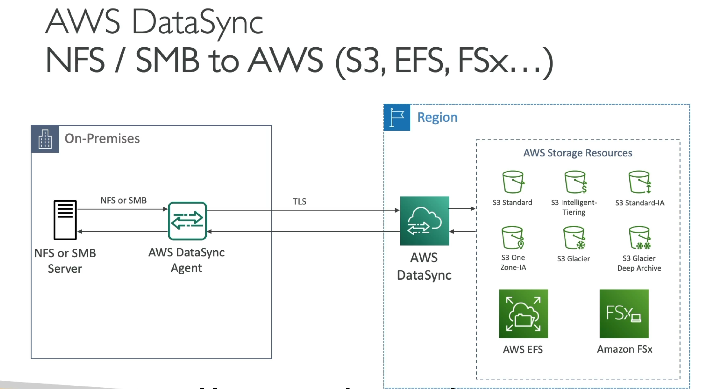
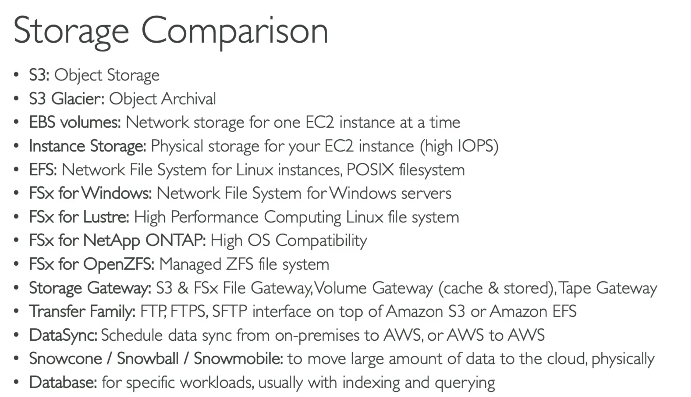

# AWS Storage Extras

This section covers additional AWS storage and data transfer services that complement Amazon S3, EBS, and EFS.

The main topics covered are:

- AWS Snow Family
- AWS Snowball Edge
- Amazon FSx
- AWS Storage Gateway
- AWS Transfer Family
- AWS DataSync
- Comparison of AWS storage solutions

---

## 1. AWS Snow Family

The **AWS Snow Family** is a collection of physical devices designed to move large amounts of data between on-premises environments and AWS.

It is especially useful when transferring data over the Internet would be too slow, expensive, or unreliable.

The Snow Family includes:

- **AWS Snowcone** – small and portable device for edge computing and data transfer
- **AWS Snowball Edge** – larger device for massive data migration and edge computing
- **AWS Snowmobile** – truck-based solution designed for extremely large migrations

### Main use cases

- Large-scale data migrations
- Datacenter migrations
- Disaster recovery
- Edge computing
- Environments with limited network connectivity

---

## 2. AWS Snowball Edge

**AWS Snowball Edge** allows large datasets to be transferred physically instead of sending them over the Internet.

Typical workflow:

1. Order a Snowball Edge device from AWS
2. AWS ships the device
3. Connect it to the local network
4. Copy the data onto the device
5. Ship the device back to AWS
6. AWS imports the data into the requested S3 bucket

### Snowball into Glacier

Snowball cannot directly import data into Amazon S3 Glacier.

The typical architecture is:

**On-Premises → Snowball → Amazon S3 → S3 Lifecycle Policy → S3 Glacier**

The data is first imported into Amazon S3 and can then automatically transition to Glacier using an S3 Lifecycle rule.

---

## 3. Amazon FSx

**Amazon FSx** provides fully managed file systems on AWS.

Instead of managing file-system servers manually, AWS handles infrastructure, maintenance, backups, and availability.

Important FSx offerings include:

### Amazon FSx for Windows File Server

Provides a fully managed native Windows file system.

Supports:

- SMB protocol
- Windows ACLs
- Active Directory integration
- Microsoft applications

### Amazon FSx for Lustre

High-performance distributed file system designed for workloads such as:

- Machine Learning
- High Performance Computing (HPC)
- Video processing
- Financial modeling
- Large-scale data processing

It can also integrate with Amazon S3.

### Amazon FSx for NetApp ONTAP

Provides NetApp ONTAP file systems as a managed AWS service.

Supports protocols such as:

- NFS
- SMB
- iSCSI

### Amazon FSx for OpenZFS

Managed file storage based on the OpenZFS file system.

### FSx Hands-On

Example deployment and configuration of an Amazon FSx file system.

---

## 4. AWS Storage Gateway

**AWS Storage Gateway** connects on-premises infrastructure with AWS cloud storage.

It provides hybrid storage capabilities while allowing applications to continue using familiar storage protocols.

Main gateway types include:

### S3 File Gateway

Provides access to Amazon S3 using:

- NFS
- SMB

Files written through the gateway are stored as objects in Amazon S3.

### FSx File Gateway

Provides low-latency access to **Amazon FSx for Windows File Server** from on-premises environments.

### Volume Gateway

Provides block storage using the **iSCSI** protocol.

It can be used for:

- Cached volumes
- Stored volumes

### Tape Gateway

Replaces physical tape backup infrastructure with virtual tapes stored in AWS.

Useful for existing backup software that already works with tape libraries.

### Storage Gateway Hands-On

Example configuration of a hybrid storage architecture using AWS Storage Gateway.

---

## 5. AWS Transfer Family

**AWS Transfer Family** is a managed service for transferring files into and out of AWS storage services using traditional file-transfer protocols.

Supported protocols include:

- SFTP
- FTPS
- FTP
- AS2

It integrates with storage services such as:

- Amazon S3
- Amazon EFS

This is useful for companies that already use FTP/SFTP workflows but want their files stored in AWS.

---

## 6. AWS DataSync

**AWS DataSync** is a managed data-transfer service designed to move large amounts of data between storage systems.

It can transfer data between:

- On-premises storage and AWS
- AWS storage services
- Different AWS Regions

Supported AWS destinations include:

- Amazon S3
- Amazon EFS
- Amazon FSx

DataSync automates many aspects of data transfer, including:

- Encryption
- Data integrity verification
- Network optimization
- Scheduling
- Metadata preservation

---

## 7. AWS Storage Options Comparison

Choosing the correct AWS storage or transfer service depends on the workload.

| Service | Main Use Case |
|---|---|
| Amazon S3 | Object storage |
| Amazon EBS | Block storage for EC2 |
| Amazon EFS | Managed Linux network file system |
| Amazon FSx | Managed specialized file systems |
| Storage Gateway | Hybrid on-premises / AWS storage |
| DataSync | Online automated data transfer |
| Snow Family | Offline / physical large-scale data transfer |
| Transfer Family | FTP / FTPS / SFTP / AS2 transfers |

---

## Key Takeaways

- **Snow Family** → physical/offline transfer of very large datasets
- **Snowball + Glacier** → Snowball → S3 → Lifecycle → Glacier
- **FSx** → managed high-performance or specialized file systems
- **Storage Gateway** → hybrid connection between on-premises storage and AWS
- **Transfer Family** → managed FTP/SFTP/FTPS/AS2 transfers
- **DataSync** → automated online data migration and synchronization
- **S3** → object storage
- **EBS** → block storage
- **EFS** → shared Linux file storage

These services provide different solutions depending on whether the requirement is **storage, migration, hybrid architecture, file sharing, or large-scale data transfer**.
