# AWS VPC & Networking

Hands-on labs covering the core networking components of Amazon VPC.

The goal of this section was to understand how AWS resources communicate inside a VPC, with the Internet, between VPCs, and with on-premises networks.

---

## 1. VPC & CIDR

Created and configured an Amazon VPC with a custom IPv4 CIDR range.

Example:

```text
VPC: 10.0.0.0/16
```

CIDR defines the range of IP addresses available inside the network.

Important examples:

```text
/32 = 1 IP
/28 = 16 IPs
/24 = 256 IPs
/16 = 65,536 IPs
```

The smaller the CIDR prefix, the larger the network.

### Private IPv4 ranges

```text
10.0.0.0/8
172.16.0.0/12
192.168.0.0/16
```

These addresses are used for private networks and are not directly routable over the public Internet.

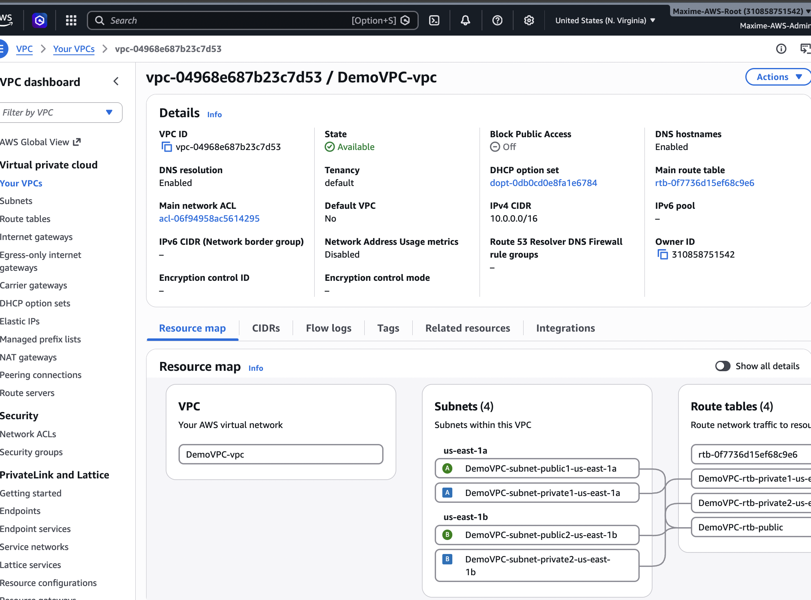

---

## 2. Public & Private Subnets

A VPC can be divided into smaller networks called subnets.

Example:

```text
VPC 10.0.0.0/16

├── Public Subnet
│   └── 10.0.1.0/24
│
└── Private Subnet
    └── 10.0.2.0/24
```

A subnet exists inside a single Availability Zone.

A **public subnet** has a route to an Internet Gateway.

A **private subnet** does not have a direct route to an Internet Gateway.

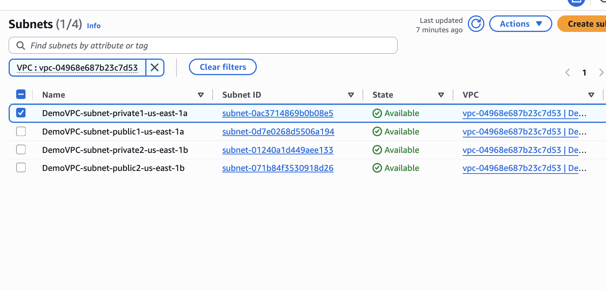

---

## 3. Internet Gateway

An Internet Gateway (IGW) connects a VPC to the Internet.

```text
Internet
   |
Internet Gateway
   |
VPC
```

For an EC2 instance to communicate directly with the Internet over IPv4, it needs:

- A public IPv4 address
- A route to the Internet Gateway
- Appropriate Security Group / NACL rules

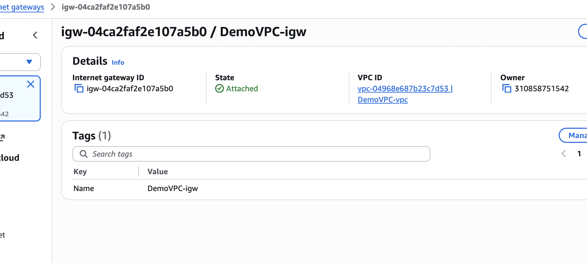

---

## 4. Route Tables

Route Tables determine where network traffic is sent.

Example:

```text
Destination       Target
10.0.0.0/16       local
0.0.0.0/0         Internet Gateway
```

`local` allows communication inside the VPC.

`0.0.0.0/0` represents all IPv4 destinations.

The most specific matching route is selected.

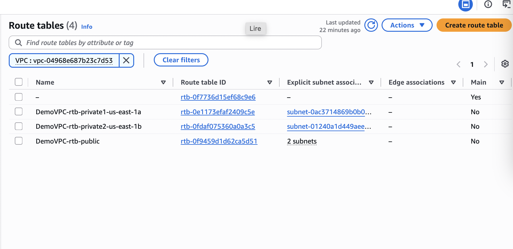

---

## 5. Bastion Host

A Bastion Host provides controlled administrative access to instances located inside private subnets.

```text
Internet
   |
Bastion Host
(Public Subnet)
   |
Private EC2
(Private Subnet)
```

The private EC2 instance does not need to expose SSH directly to the Internet.

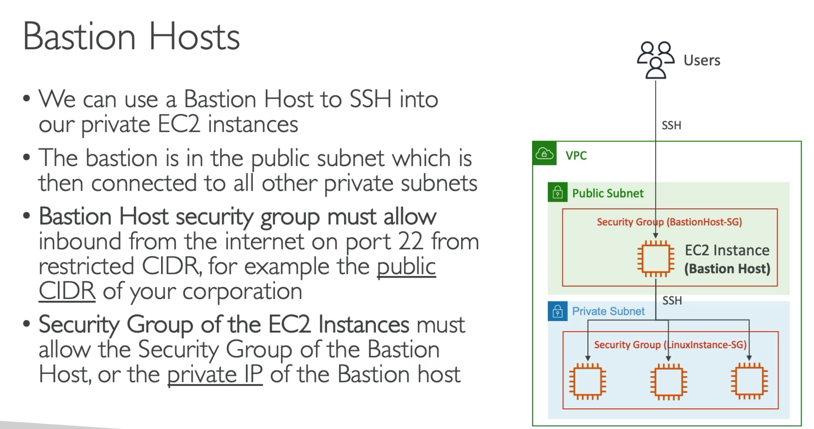

---

## 6. NAT Instance

A NAT Instance is an EC2 instance configured to forward Internet traffic for private instances.

```text
Private EC2
    |
NAT Instance
    |
Internet Gateway
    |
Internet
```

Important characteristics:

- Located in a public subnet
- Requires a public / Elastic IP
- Source/destination checks must be disabled
- Requires manual scaling and high availability

NAT Instances are largely replaced by managed NAT Gateways.

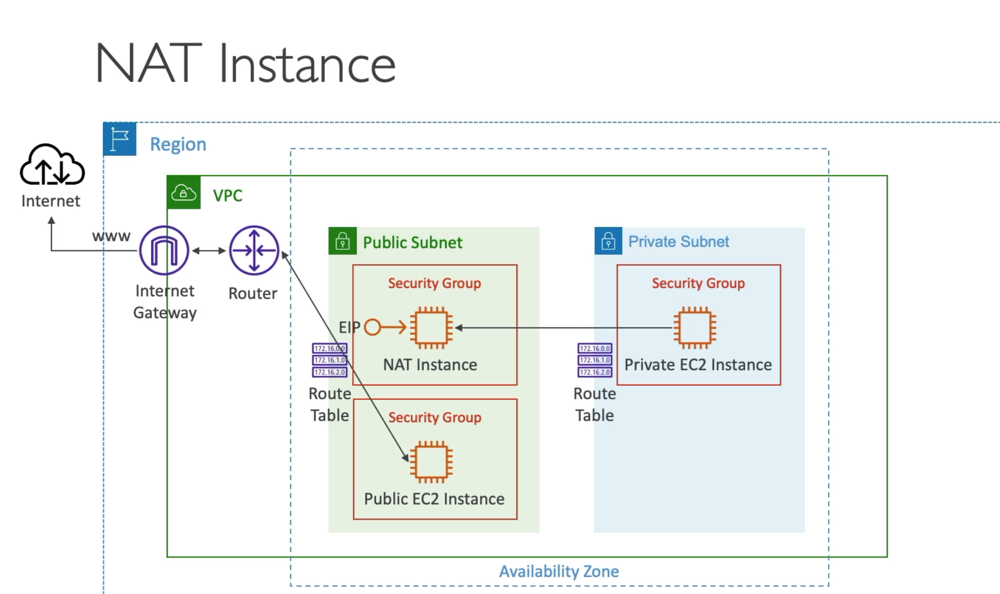

---

## 7. NAT Gateway

A NAT Gateway allows instances in private subnets to initiate IPv4 connections to the Internet.

```text
Private EC2
    |
Private Route Table
    |
NAT Gateway
    |
Internet Gateway
    |
Internet
```

Private Route Table:

```text
Destination       Target
10.0.0.0/16       local
0.0.0.0/0         NAT Gateway
```

The NAT Gateway must be located in a **public subnet** for public Internet egress.

Internet hosts cannot initiate connections directly toward the private EC2 through the NAT Gateway.

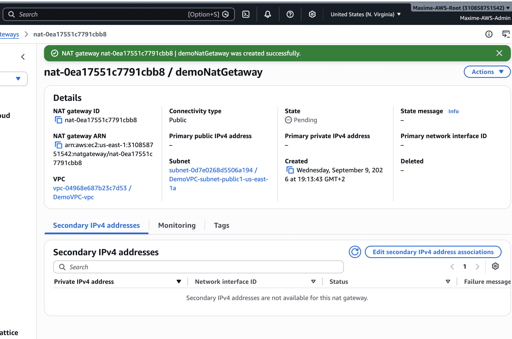

---

## 8. Security Groups & NACLs

AWS provides two important network security mechanisms.

### Security Groups

- Operate at ENI/resource level
- Stateful
- Allow rules only
- Return traffic is automatically allowed for permitted connections

### Network ACLs

- Operate at subnet level
- Stateless
- Allow and Deny rules
- Rules evaluated by rule number
- Inbound and outbound traffic evaluated separately

| Feature | Security Group | NACL |
|---|---|---|
| Level | ENI / Resource | Subnet |
| Stateful | Yes | No |
| Allow | Yes | Yes |
| Deny | No | Yes |
| Rule order | All rules | Numerical |

```text
Internet
   |
 NACL
   |
Subnet
   |
Security Group
   |
 EC2
```

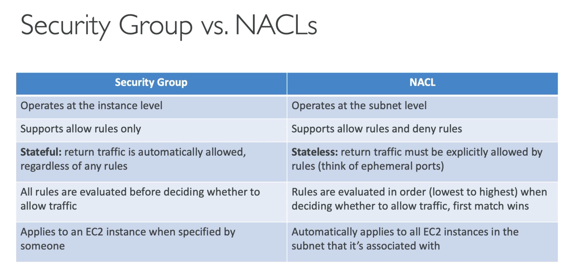

---

## 9. VPC Peering

VPC Peering creates private connectivity between two VPCs.

```text
VPC A <------> VPC B
```

Important characteristics:

- Private IP communication
- No Internet Gateway required for the peering traffic
- CIDR ranges cannot overlap
- Route Tables must be configured
- Peering is NOT transitive

Example:

```text
A <-> B <-> C
```

A cannot automatically communicate with C.

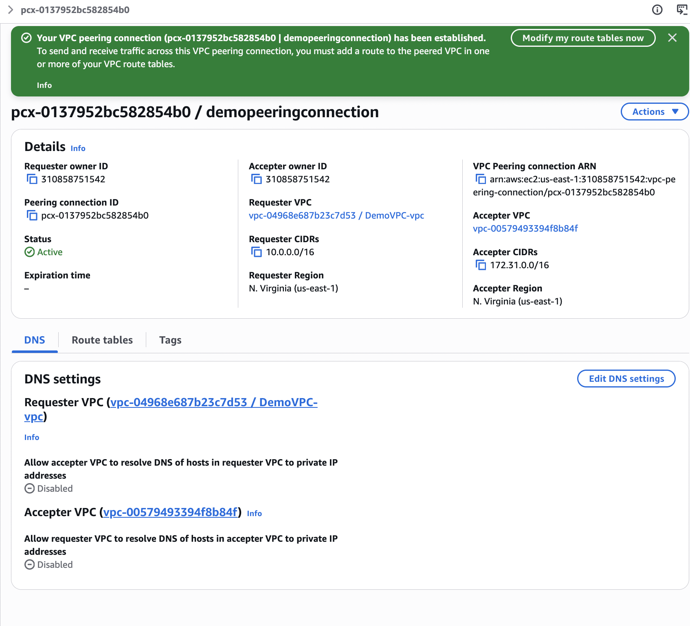

---

## 10. VPC Endpoints

VPC Endpoints allow private access to supported AWS services without requiring Internet connectivity.

### Gateway Endpoints

Available for:

```text
Amazon S3
Amazon DynamoDB
```

They are associated with Route Tables.

### Interface Endpoints

Interface Endpoints use **AWS PrivateLink**.

They create Elastic Network Interfaces with private IP addresses inside the VPC.

```text
Private EC2
    |
VPC Endpoint
    |
AWS Service
```

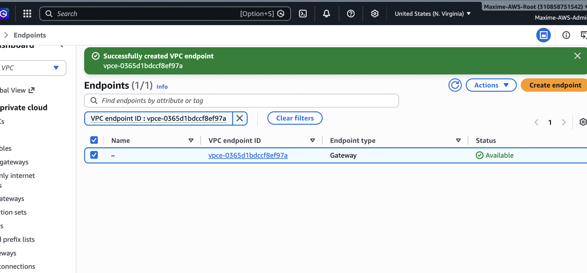

---

## 11. VPC Flow Logs

VPC Flow Logs capture metadata about IP traffic.

They can help troubleshoot:

- Accepted traffic
- Rejected traffic
- Security Groups
- NACLs
- Connectivity problems
- Unexpected network traffic

Flow Logs can send data to destinations such as:

```text
CloudWatch Logs
Amazon S3
```

Flow Logs contain traffic metadata, not packet payload contents.

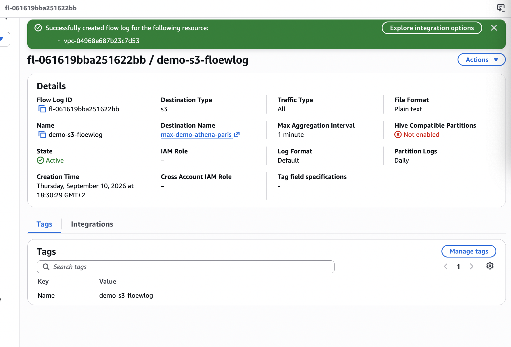

---

## 12. VPC Flow Logs + Athena

VPC Flow Logs stored in Amazon S3 can be queried using Amazon Athena.

Possible use cases:

- Find rejected connections
- Identify source IPs
- Identify destination IPs
- Investigate suspicious traffic
- Troubleshoot network connectivity

```text
VPC Flow Logs
      |
      S3
      |
    Athena
      |
  SQL Queries
```

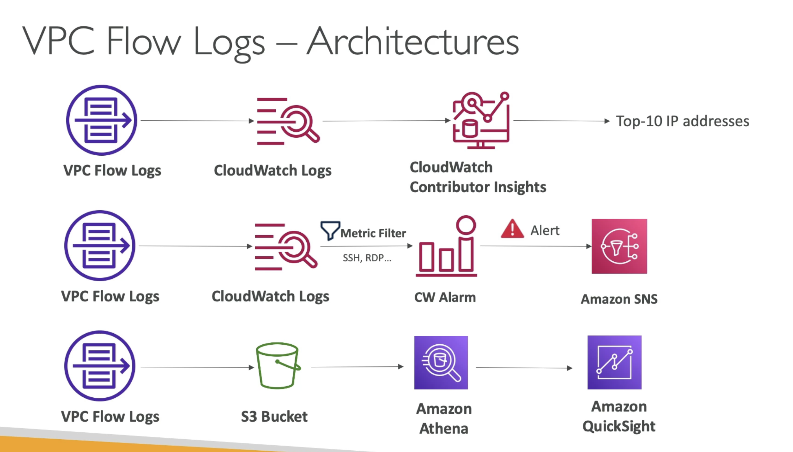

---

## 13. Site-to-Site VPN

AWS Site-to-Site VPN connects an AWS network to an on-premises network using encrypted IPsec tunnels.

```text
AWS VPC
   |
Virtual Private Gateway
   |
Encrypted VPN Tunnels
   |
Customer Gateway
   |
Corporate Data Center
```

### Virtual Private Gateway

Gateway on the AWS side of a VPC-based VPN architecture.

### Customer Gateway

Represents the customer-side VPN device/network.

Site-to-Site VPN uses the public Internet but encrypts the traffic.

AWS provides two VPN tunnels for redundancy.

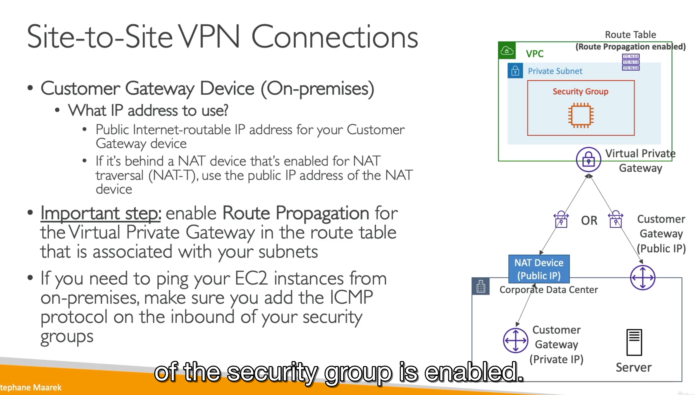

---

## 14. AWS Direct Connect

AWS Direct Connect provides a dedicated network connection between customer infrastructure and AWS.

```text
Corporate Network
       |
Direct Connect
       |
      AWS
```

Benefits include:

- More consistent performance
- Dedicated connectivity
- High bandwidth
- Reduced dependency on the public Internet

Unlike Site-to-Site VPN, Direct Connect is not simply an encrypted tunnel across the public Internet.


## 15. Direct Connect + Site-to-Site VPN

Direct Connect and VPN technologies can be combined when both dedicated connectivity and encryption are required.

```text
Site-to-Site VPN
= encrypted connectivity over Internet

Direct Connect
= dedicated network connection

Direct Connect + VPN
= dedicated path + encryption
```


---

## 16. Transit Gateway

AWS Transit Gateway acts as a central networking hub.

Instead of creating many individual VPC Peering connections:

```text
        VPC A
          |
VPC B -- TGW -- VPC C
          |
         VPN
```

Transit Gateway supports:

- Multiple VPCs
- VPN connections
- Hub-and-spoke networking
- Transitive routing
- Large network architectures


---

## 17. VPC Traffic Mirroring

VPC Traffic Mirroring copies network traffic from supported network interfaces to monitoring or security appliances.

Use cases include:

- Deep packet inspection
- Threat detection
- Network troubleshooting
- Security monitoring

Unlike Flow Logs, Traffic Mirroring can provide actual packet-level traffic to inspection tools.


---

## 18. IPv6 for VPC

AWS VPC supports IPv6 networking.

Important characteristics:

- IPv6 addresses are globally unique
- NAT is generally not required
- Security Groups and NACLs still control traffic
- `::/0` represents all IPv6 destinations

```text
IPv4 all destinations = 0.0.0.0/0

IPv6 all destinations = ::/0
```


---

## 19. Egress-Only Internet Gateway

An Egress-Only Internet Gateway provides outbound Internet connectivity for IPv6 resources while preventing unsolicited inbound connections through the gateway.

```text
IPv6 Resource
     |
Route Table
     |
Egress-Only IGW
     |
 Internet
```

It provides a concept similar to outbound-only Internet access without performing NAT.


---

## 20. Networking Costs

AWS networking architecture can significantly affect cost.

Important cost areas include:

- NAT Gateway hourly charges
- NAT Gateway data processing
- Cross-AZ traffic
- Internet data transfer
- VPC Peering
- Transit Gateway
- Direct Connect

Architecture decisions should therefore consider both performance and data-transfer costs.


---

## 21. AWS Network Firewall

AWS Network Firewall provides managed network traffic filtering and inspection.

Capabilities include:

- Stateful inspection
- Network filtering
- Domain filtering
- Intrusion prevention
- Centralized network security

It provides more advanced inspection capabilities than Security Groups and NACLs alone.


---

# Core VPC Architecture

```text
                         INTERNET
                             |
                      Internet Gateway
                             |
                       Public Subnet
                             |
                        NAT Gateway
                             |
                    Private Route Table
                             |
                       Private Subnet
                             |
                         Private EC2
```

The fundamental networking logic is:

```text
VPC
 |
Subnets
 |
Route Tables
 |
Gateways / Endpoints
 |
Resources
```

Security is then applied using:

```text
Security Groups
+
Network ACLs
```

---

# Public vs Private Subnet

### Public Subnet

```text
EC2 + Public IP
       |
Route Table
       |
0.0.0.0/0
       |
Internet Gateway
       |
Internet
```

### Private Subnet

```text
Private EC2
     |
Route Table
     |
0.0.0.0/0
     |
NAT Gateway
     |
Internet Gateway
     |
Internet
```

---

# Hybrid Connectivity

```text
                    AWS
                     |
            +--------+--------+
            |                 |
     Site-to-Site VPN    Direct Connect
            |                 |
     Public Internet      Dedicated Link
            |                 |
            +--------+--------+
                     |
             Corporate Network
```

---

# VPC Connectivity Cheat Sheet

| Component | Purpose |
|---|---|
| VPC | Isolated AWS network |
| CIDR | Defines network IP range |
| Subnet | Network segment inside an AZ |
| Route Table | Determines where traffic goes |
| Internet Gateway | Internet connectivity |
| NAT Gateway | Outbound IPv4 Internet for private resources |
| Bastion Host | Administrative access to private resources |
| Security Group | Stateful ENI/resource firewall |
| NACL | Stateless subnet firewall |
| VPC Peering | Direct private connection between VPCs |
| VPC Endpoint | Private access to AWS services |
| PrivateLink | Private service connectivity |
| Flow Logs | Network traffic metadata |
| Site-to-Site VPN | Encrypted hybrid connection |
| Direct Connect | Dedicated AWS connection |
| Transit Gateway | Central network hub |
| Traffic Mirroring | Packet traffic inspection |
| Egress-Only IGW | Outbound IPv6 Internet |
| Network Firewall | Managed traffic filtering |

---

# SAA Exam Cheat Sheet

### Public subnet

```text
Route to Internet Gateway
+
Public IP for direct IPv4 Internet communication
```

### Private subnet Internet access

```text
Private EC2
→ NAT Gateway
→ Internet Gateway
→ Internet
```

### Security Group

```text
STATEFUL
ALLOW only
Resource / ENI level
```

### NACL

```text
STATELESS
ALLOW + DENY
Subnet level
```

### VPC Peering

```text
VPC ↔ VPC
No transitive routing
No overlapping CIDRs
```

### Transit Gateway

```text
Central hub
Transitive routing
Many VPCs / VPNs
```

### VPC Endpoint

```text
Private access to AWS services

Gateway Endpoint:
S3 + DynamoDB

Interface Endpoint:
AWS PrivateLink
```

### Hybrid Networking

```text
Site-to-Site VPN
→ encrypted over Internet

Direct Connect
→ dedicated connection

Direct Connect + VPN
→ dedicated + encrypted
```

### IPv6

```text
::/0 = all IPv6 destinations

Egress-Only IGW
= outbound-only Internet gateway for IPv6
```

---

# Skills Practiced

- Amazon VPC
- CIDR addressing
- Public and private subnets
- Route Tables
- Internet Gateway
- NAT Instance
- NAT Gateway
- Bastion Hosts
- Security Groups
- Network ACLs
- VPC Peering
- VPC Endpoints
- AWS PrivateLink
- VPC Flow Logs
- Amazon Athena
- Site-to-Site VPN
- Virtual Private Gateway
- Customer Gateway
- AWS Direct Connect
- Direct Connect Gateway
- AWS Transit Gateway
- VPC Traffic Mirroring
- IPv6
- Egress-Only Internet Gateway
- AWS networking costs
- AWS Network Firewall

---

# Final Takeaway

Amazon VPC is the networking foundation of AWS.

The most important concept is understanding the path taken by network traffic:

```text
Source
  |
Security Controls
  |
Subnet
  |
Route Table
  |
Gateway / Endpoint / Network Connection
  |
Destination
```

Understanding this path makes it possible to design, secure, and troubleshoot AWS architectures involving public resources, private workloads, multiple VPCs, and hybrid on-premises connectivity.
